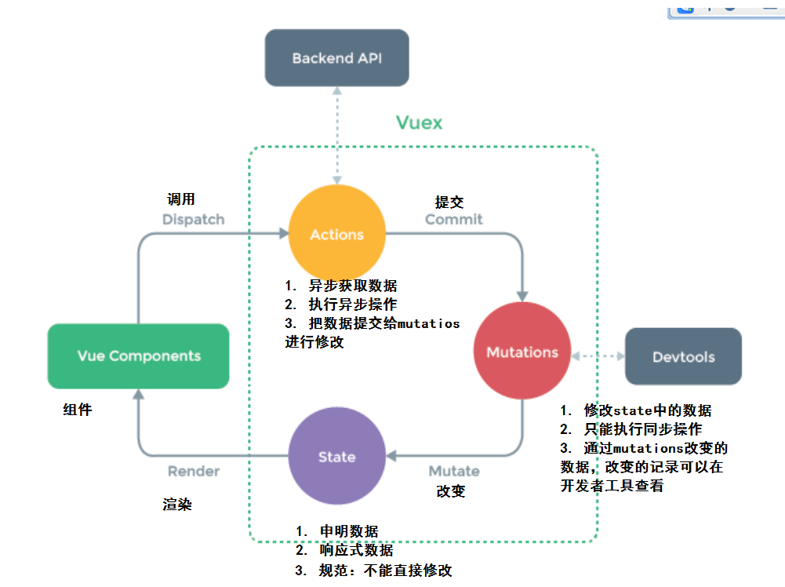

## vuex基础-介绍

props /$emit /eventBus

ref => 获取一个组件实例对象 , 可以调用该组件的方法 也就可以传值

​	Vuex 是一个专为 Vue.js 应用程序开发的**状态管理模式**。它采用**`集中式`**存储管理应用的所有组件的状态，并以相应的规则保证状态以一种**`可预测`**的方式发生变化。

- vuex是采用集中式管理组件依赖的共享数据的一个工具，可以解决不同组件数据共享问题。


<font color="red">看图结论：</font>

> 所有的公共状态修改 必须通过谁  ?  **`mutations`** , 这是vuex设计的规范和原则

而且 mutations的中 修改状态方法 必须是 **`同步代码`** 

由于mutaition只能 写同步代码, 所以 提供一个action  负责 异步的处理, action获取的异步的结果 可以 提交(commit) 给mutation

> 组件中的状态 是有 state决定, state变化 , 组件更新

state决定 组件的显示和渲染

> state的更改只能由 mutations 决定, 只能通过mutations来修改状态,别的方式一律不行
>
> 别的方式即使你把数据改了 ,视图也不会更新

mutations只能是同步代码,也就意味着 不能写 定时器,异步请求 

> mutations 中的一次更新 就要对应一个状态, 相当于当前状态的**`快照`**

那么异步请求放在哪 ?

> 异步请求放在了 actions中, 这里面可以进行异步请求, 请求完的结果,必须通过 mutations来修改




## vuex基础-初始化功能

> 建立一个新的脚手架项目, 在项目中应用vuex

```bash
$ vue create vuexdemo
```

> 开始vuex的初始化建立

初始化：

- 第一步：`npm i vuex --save`  => 安装到**`运行时依赖`**   => 项目上线之后依然使用的依赖 ,开发时依赖  => 开发调试时使用  
- 第二步：`import vuex from 'vuex'`
- 第三步：`Vue.use(vuex)`  => 调用了 vuex中的 一个install方法
- 第四步：`const store = new Vuex.Store({...配置项})`
- 第五步：在根实例配置 store 选项指向 store 实例对象

```js
import Vue from 'vue'
import Vuex from 'vuex'
Vue.use(vuex)
const store = new Vuex.Store({})
new Vue({
  el: '#app',
  store
})
```


## vuex基础-state

- 管理数据, 管理的公共状态数据

> 如果你有一个公共状态数据, 你只需要定义在 state对象中

```js
// 初始化vuex对象
const store = new vuex.Store({
  state: {
    // 管理数据
    count: 0
  }
})
```

> 组件中可以使用  this.$store 获取到  vuex中的store对象实例

在组件获取state的数据：原始用法插值表达式

```html
<div>A组件 state的数据：{{$store.state.count}}</div>
```

使用计算属性：

```js
// 把state中数据，定义在组件内的计算属性中
  computed: {
    // 1. 最完整的写法
    // count: function () {
    //   return this.$store.state.count
    // },
    // 2. 缩写
    count () {
      return this.$store.state.count
    }
  }
```


## vuex基础-mapState

> mapState是辅助函数, 帮助我们把store中的数据映射到 组件的计算属性中, 它属于一种 方便用法

- 把vuex中的state数据映射到组件的计算属性中。
- **`辅助函数`**，生成计算属性。

导入：

```js
import { mapState } from 'vuex'
```

1. 使用：mapState(对象)  => mapState => 返回一个对象

```JS
  computed:mapState({
    //   key:value
    // key 是计算属性的key value有两种形式 字符串 /函数
    count2: 'count'  // 表示计算属性中有一个count名 来源于 store中的state.count
  })

  <p>mapState:{{ count2 }}</p>

```

2. 使用：mapState(数组)

```js
//  state字段名称
computed: mapState(['count'])

```

3. 如果组件自己有计算属性，state的字段映射成计算属性

这种形式 不影响计算属性自己定义 属性 

> 这种形式最为常见

```js
   computed: {
      ...mapState(['count','name']),
   }
```


## vuex基础-mutations

> 组件数据来源于state, 但是修改state必须通过mutations

- 修改数据

> mutations是一个对象, 对象中存放修改state的方法
>
> payload 载荷 传输的意思 传递参数的对象 可以在任何提交里 放入载荷数据

```js
mutations: {
    // state就是当前 的状态 对象state
    自定义方法(state, payload) {
        
    }
}
```

> 调用mutations的方法 ? 

``` js
this.$store.commit(mutations方法名, payload) // 第一个参数是方法名 第二个参数是载荷对象(可不传)
```

> 案例

声明：

```js
// 修改公共状态的方法 只能是同步代码
  mutations:{
    // add方法 是更改 state的方法
    // state是当前的state对象, payload是 传输的参数对象
    updateCount (state, payload) {
      // 直接对于state中的数据进行修改
       state.count += payload.step  // 每次加传过来的步长
    }
  },
```

调用：

```js
add () {
        // 怎么修改公共状态的数据呢 ? 
        // this.$store.commit(mutations方法名, payload) // 第一个参数是方法名 第二个参数是载荷对象(可不传)
        // 载荷想传什么传什么
        this.$store.commit('updateCount', { step: 5 })
      }
```

* 修改state 必须通过 **`mutations`**

## vuex基础-mapMutations

* 和 mapState的功能类似  => **`简化调用的代码`**

- 把vuex中的mutations的函数映射到组件的methods中
- 通俗：通过mapMutations函数可以生成methods中函数

语法:   mapMutations([ '方法名' ]) 

```js
  methods:{
    add () {
      // but这里 能不能直接调用到 store的mutations呢?
      this.$store.commit("addCount", { num: 10 })  // 提交 载荷到mutations
    },
    ...mapMutations(['addCount', 'cutCount'])  // 字符串数组 =>methods中定义了一个addCount  => store.commit('addCount)
  }
```


## vuex基础-actions

> state 状态 mutation(更改状态,同步) actions(异步获取数据)

- 异步获取数据

> actions对象中 可以定义 action方法 

```js
actions: {
    // store实际上就是 $store对应实例对象  store.state (取状态) store.commit() // 提交修改
    // params是传递过来的参数 可传可不传
    自定义方法(store, params) {}
}
```

代码

```js
  // 异步数据获取方式 想要更改state必须通过mutaitons
  actions:{
    // 获取数据的action 异步的 setTimeout /setInterval
    // store就是 当前store实例对象 store.state 获取  store.commit() 
    getCount (store) {
      setTimeout(function(){
          // 生成一个值 加到state中的count上
          store.commit('updateCount', {
            step: 3
          })
      }, 2000)
    }
  }
```

> 异步的请求必须放在 action中,  至于同步的话 放在 mutation或者action都可以

调用 

```js
 this.$store.dispatch("getCount")
```

this.$store.commit()  // 提交到 mutation修改

this.$store.dispatch()  // 调用action

```js
  this.$store.dispatch("getCount", 100)  // 传参
  this.$store.dispatch("getCount")  // 不传参

// 后面100的位置 可以传各种类型 对象/数组/数值

```


## vuex基础-mapActions

* mapState(把数据给计算属性), mapMutations(把方法给methods), mapActions(把方法给 methods)

- mapActions辅助函数，把actions中的函数映射组件methods中
- 通俗：通过mapActions函数可以生成methods中函数

```js
 ...mapActions(['getCount'])  // 此时 组件中就有了一个getCount方法 对应 store中action中的getCount

```

组件

state  => 决定组件的样式 

mutations => 必须通过 mutation改变state, mutations必须是同步代码  => this.$store.commit()

actions => 异步请求 异步操作 提交mutation 来修改state => this.$store.dispatch()  => action

辅助函数

mapState  => store中的数据映射到 组件计算属性上

mapMutations => 把mutations方法映射到 组件的methods方法中

mapActions => action方法映射到 methods方法中

辅助函数是可以不用的,不用的话 就用原始的方式调用


## vuex案例-豆瓣接口

豆瓣接口地址支持jsonp但是不支持**`cors`**。 => 

* cors跨域 设置  => allow => 允许所有接口访问  => 后端设置
* jsonp => 请求 =>必须用jsonp来访问 => 不能axios

- http://api.douban.com/v2/movie/subject/:id  详情
- http://api.douban.com/v2/movie/in_theaters  正在热映
- http://api.douban.com/v2/movie/coming_soon  即将上映
- http://api.douban.com/v2/movie/top250  top250

注意：

- 豆瓣的接口请求限制，每个外网IP有请求次数限制。
- 豆瓣的图片访问显示，非豆瓣域名下发起的图片请求不给予响应。=> 代理服务器解决  => 代理服务器
- 近期：官方停用搜索相关接口，必须要注册豆瓣api平台获取认证apikey才行。
- 网友提供 `apikey=0df993c66c0c636e29ecbb5344252a4a`  <font color="red">大家慎用</font>


## vuex案例-搭建项目

> 通过vue-cli脚手架搭建项目

```bash 
$ vue create douban  #创建项目
```

> 选择  vuex / router /eslint / pre-cssprocesser

创建完毕之后,将豆瓣静态资源的样式 放置在style中,并在main.js中引入

```js
import './styles/css/global.css'
import './styles/fonts/iconfont.css'
```

> 接下来根据页面的布局封装 组件


> 首先封装 头部组件 layout-header.vue  和底部组件 layout-footer.vue, 并在App.vue中使用

```vue
<!-- app.vue是根组件 -->
  <div id="app">
    <!-- 头部组件 -->
    <LayoutHeader />
    <div class="wrapper">
        <!-- 一级路由容器 -->
       <router-view />
    </div>
    <!-- 尾部组件 -->
    <LayoutFooter />
  </div>
```

> 封装四个路由组件 

- 正在热映
- 即将上映
- top250
- 电影详情

> 路由规则如下

路由级组件一般放置在 views(pages)

```js
const routes = [
  {
    path: '/',
    redirect: '/hot' // 强制跳转到正在热映
  },
  {
    path: '/hot', // 正在热映
    component: () => import('@/views/hot')
  },
  {
    path: '/movie', // 即将上映
    component: () => import('@/views/movie')
  }, {
    path: '/top', // top250榜单
    component: () => import('@/views/top')
  },
  {
    path: '/detail', // 豆瓣影片详情
    component: () => import('@/views/detail')
  }
]
```

> 封装一个公共的list组件 movie-list  内部放置豆瓣列表

```vue
<template>
  <div class="wrapper">
        <ul class="list">
          <li>
            <a href="./item.html">
              
              <div class="info">
                <h3>徒手攀岩</h3>
                <p>豆瓣评分：9</p>
                <p><span class="tag">纪录片</span></p>
              </div>
            </a>
          </li>
        </ul>
      </div>
</template>

<script>
export default {

}
</script>

<style>

</style>

```

> 修改底部的导航, 适配 路由地址

```vue
 <div class="my-footer">
    <ul>
      <!-- 跳转可以用router-link router-link默认生成的是a标签 -->
      <!-- 怎么改变router-link的标签呢 ? -->
      <router-link tag="li" to="/hot">
        <a>
          <span class="iconfont icon-remen"></span>
          <p>正在热映</p>
        </a>
      </router-link>
      <router-link tag="li" to="/movie">
        <a>
          <span class="iconfont icon-dianying"></span>
          <p>即将上映</p>
        </a>
      </router-link>
      <router-link tag="li" to="/top">
        <a>
          <span class="iconfont icon-top"></span>
          <p>top250</p>
        </a>
      </router-link>
    </ul>
  </div>
```

## vuex案例-电影列表功能

第一步：声明数据，根据页面需要的数据进行声明。=> vuex => state

我们把电影列表数据作为一个 共享的状态数据来对待

* state
*  mutations
* actions

```js
state: {
    // 存放公共数据的地方
    title: '', // 当前的标题
    list: [] // 当前的电影列表
  },
```

第二步：定义修改数据的方法

```js
  mutations: {
    // 用来更新 state中的title和list
    // state是当前的状态对象  payload 提交mutations传过来的参数
    updateListAndTitle (state, payload) {
      // 直接对state的数据进行赋值即可
      state.title = payload.title // payload想是什么是什么
      state.list = payload.list // 接收载荷中的list
    }
  }
```

第三步：获取数据的方法

* 使用jsonp插件

* ```bash
  $  npm i jsonp -S
  ```

  > 异步获取数据 需要用action

```js
  // action可以做异步请求
  actions: {
    // action中的第一个是store
    getList (store, type) {
      //  请求豆瓣的数据
      // jsonp(url, opt(可选), callback)
      // 将这个请求变成活的
      // hot  /movie / top250 接口地址 除了 类型 返回结果全一样
      jsonp(`http://api.douban.com/v2/movie/${type}?apikey=0df993c66c0c636e29ecbb5344252a4a`, function (err, data) {
        if (err) return false // 如果err存在表示出问题了 出篓子了不能继续了
        console.log(data)
        // 如果你action中的数据想要改state 必须通过mutations
        store.commit('updateListAndTitle', {
          title: data.title,
          list: data.subjects
        })
      })
    }
  }
```

第四步：调用获取数据的方法

```js
export default {
  created () {
    // 尝试调用 action方法
    this.$store.dispatch('getList', 'in_theaters') // 调用action的方法
  }
}
```

第五步：获取vuex的数据 在公共组件 mover-list中

```js
computed: {
    ...mapState(['list'])
  },
```

第六步：渲染页面


```html
  <ul class="list">
          <li v-for="item in list" :key="item.id">
            <a href="./item.html">
            <!-- 这里用了图片的代理服务器  因为豆瓣的图片禁止在非豆瓣域名下展示 -->
              
              <div class="info">
                <h3>{{ item.title }}</h3>
                <p>豆瓣评分：{{ item.rating.average }}</p>
                <p><span v-for="obj in item.genres" :key="obj" class="tag">{{ obj }}</span></p>
              </div>
            </a>
          </li>
        </ul>
```


## vuex案例-电影详情功能

- 电影列表  电影的详情地址   都不一样   都会来到电影详情组件
  - 使用动态路由功能  /detail/:id  
  - 电影详情组件获取id获取详情数据

第一步：路由规则

```js
{ path: '/detail/:id', component: Detail }
```

```js
  <router-link :to="`/detail/${item.id}`">
```

第二步：准备数据

```js
state: {
    // 存放公共数据的地方
    title: '', // 当前的标题
    list: [], // 当前的电影列表
    detail: null // detial表示是详情数据
  },
```

第三步：修改数据函数

```js
mutations: {
    // 专门来更新 detail数据和标题
    updateDetail (state, payload) {
      state.title = payload.title
      state.detail = payload.detail
    }
  },
```

第四步：获取数据去修改数据的函数

```js
    // 定义一个action 来获取详情数据
    getDetail (store, id) {
      //  请求数据
      jsonp(`http://api.douban.com/v2/movie/subject/${id}?apikey=0df993c66c0c636e29ecbb5344252a4a`, function (err, data) {
        if (err) return false
        console.log(data)
        store.commit('updateDetail', {
          title: data.title,
          detail: data // 将整个的data作为载荷数据传递过去
        })
      })
    }
```

第五步：在组件使用数据

```js
computed: {
    ...mapState(['detail'])
  },
```

第六步：在组件初始化获取数据

```js
<template>
  <div class="item" v-if="detail">
        
        <div>
          <p>豆瓣评分：{{ detail.rating.average }}</p>
          <p>产地：{{ detail.countries[0] }}</p>
          <p><span v-for="item in detail.genres" class="tag" :key="item">{{ item }}</span></p>
          <p>{{ detail.summary }}</p>
        </div>
      </div>
</template>

<script>
import { mapState } from 'vuex'
export default {
  created () {
    //  调用action
    this.$store.dispatch('getDetail', this.$route.params.id)
  },
  computed: {
    ...mapState(['detail'])
  }
}
</script>

<style>

</style>

```


第七步：渲染页面


处理：空数据报错问题

```js
 <div class="item" v-if="item">
```

