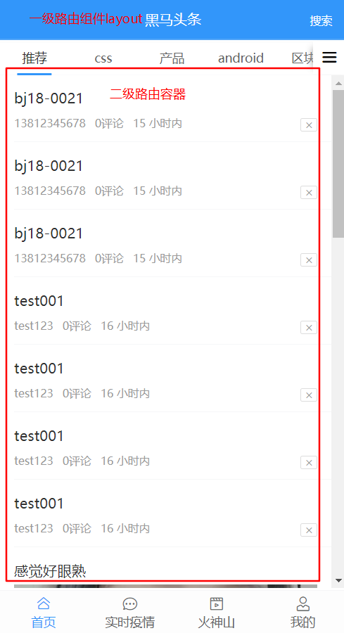
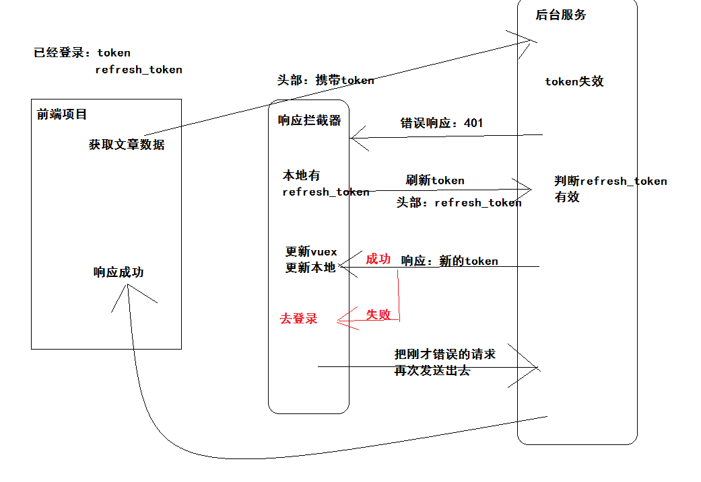

## 约定路由规则

layout组件下 有 四个二级路由组件

| path           | 功能           | 路由级别       |
| -------------- | -------------- | -------------- |
| /              | 布局组件layout | **`一级路由`** |
| ├─ /           | 首页组件       | 二级路由       |
| ├─ /question   | 问答组件       | 二级路由       |
| ├─ /video      | 视频组件       | 二级路由       |
| ├─ /user       | 个人中心组件   | 二级路由       |
| /user/chat     | 小智同学组件   | **`一级路由`** |
| /login         | 登录组件       | **`一级路由`** |
| /user/profile  | 编辑资料组件   | **`一级路由`** |
| /search        | 搜索中心组件   | **`一级路由`** |
| /search/result | 搜索结果组件   | **`一级路由`** |
| /article       | 文章详情       | **`一级路由`** |

- 根据参考图，设计路由规则。



## 实现路由配置

*  根据设计的路由规则
* 按需加载 => webpack  文件打包成一个js  或者多个js文件
* 按需加载  => 将一个个模块打包成一个个js , 会减轻首屏渲染的压力
* spa => 一次性 把所有内容都加载到页面上, 

```js
// 用按需加载的方式配置路由
const Layout = () => import('@/views/layout') // 按需引入layout
const home = () => import('@/views/home') // 按需引入home 二级路由
const question = () => import('@/views/question') // 按需引入question 二级路由
const video = () => import('@/views/video') // 按需引入video  二级路由
const user = () => import('@/views/user') // 按需引入user 二级路由
// 其他的一级路由
const chat = () => import('@/views/user/chat') // 小智同学
const login = () => import('@/views/login') // 登录模式
const profile = () => import('@/views/user/profile') // 编辑资料
const search = () => import('@/views/search') // 搜索中心
const searchresult = () => import('@/views/search/result') // 搜索结果
const article = () => import('@/views/article') // 文章中心

const routes = [
  {
    path: '/',
    name: 'Home',
    component: Layout, // 布局组件 一级路由
    children: [{
      path: '', // 如果path什么都不写 默认就是二级路由的默认组件
      component: home
    }, {
      path: '/question',
      component: question // 问答组件
    }, {
      path: '/video',
      component: video // 视频组件
    }, {
      path: '/user',
      component: user
    }]
  }, {
    path: '/user/chat', // 一级路由 小智同学
    component: chat
  }, {
    path: '/login',
    component: login // 一级路由 登录
  }, {
    path: '/user/profile',
    component: profile // 一级路由编辑资料
  }, {
    path: '/search',
    component: search // 一级路由 搜索中心
  }, {
    path: '/search/result',
    component: searchresult // 一级路由搜索中心
  }, {
    path: '/article',
    component: article // 一级路由 文章详情
  }

]

```

- 根据约定的路由规则定义。
- 且先定义规则对应的组件。


## 完成Layout组件

```vue
<template>
 <div class="container">
    <!-- 可以采用vant的导航组件 来实现 -->
    <van-nav-bar  v-if="showNavBar" fixed title="黑马头条" right-text="搜索"></van-nav-bar>
    <!-- 二级路由容器  首页/问答/视频/我的-->
    <!-- :class="{ 名称: 布尔值 }" -->
    <div class="my-wrapper" :class="{ noTop: !showNavBar }">
      <router-view></router-view>
    </div>
    <!-- 标签栏  开启路由模式 route :route="true"(布尔)  route="true"(字符串)-->
    <van-tabbar route>
      <!-- router-link  to  -->
      <van-tabbar-item to="/" icon="home-o">首页</van-tabbar-item>
      <van-tabbar-item to="/question" icon="chat-o">问答</van-tabbar-item>
      <van-tabbar-item to="/video" icon="video-o">视频</van-tabbar-item>
      <van-tabbar-item to="/user" icon="user-o">我的</van-tabbar-item>
    </van-tabbar>
  </div>
</template>

<script>
export default {
  name: 'layout',
  computed: {
    // 是否显示navbar
    showNavBar () {
      // this  指向 组件实例
      return this.$route.path !== '/user'
    }
  }
}
</script>

<style scoped lang='less'>
.container{
  width: 100%;
  height: 100%;
  position: relative;
  .my-wrapper{
    width: 100%;
    height: 100%;
    overflow: hidden;
    padding-top: 46px;
    padding-bottom: 50px;
    box-sizing: border-box;
    &.noTop{
      padding-top: 0;
    }
  }
}
</style>
```

- 提供  首页 问答 视频 我的  基础布局，也就是一级路由组件。
- 回退历史，需要根据地址栏去选中TabBar对应标签，开启路由模式组件内部实现。
- 如果选中的是 `我的` 标签，应该隐藏 NavBar , 内容容器 my-wrapper 去除上内边距。
- 点击搜索，跳转到搜索中心页面。

### 全局样式

`src/styles/index.less`

```less
// -----------------------全局样式-----------------------
*{
  margin: 0;
  padding: 0;
}
ul{
  list-style: none;
}
#app{
  position: absolute;
  left: 0;
  top: 0;
  overflow: hidden;
  width: 100%;
  height: 100%;
  font-size: 14px;
}

// -----------------------覆盖vant-----------------------
.van-nav-bar {
  background: #3296fa;
  .van-nav-bar__title {
    color: #fff;
  }
  .van-nav-bar__text {
    color: #fff;
    font-size: 12px;
  }
  .van-icon{
    color: #fff;
  }
}
.van-tabbar{
  background: #fdfdfd;
}
.van-nav-bar__text:active{
  background: transparent;
}
```

```js
import '@/styles/index.less' // 引入全局的自定义样式  因为要覆盖vant的样式

```

给搜索按钮添加事件

```html
    <van-nav-bar @click-right="$router.push('/search')" fixed title="黑马头条" right-text="搜索" v-if="$route.path!== '/user'"></van-nav-bar>

```

## 其他功能组件-骨架屏-基本编写

**home组件**

```vue
<template>
  <div class='container'>
      主页
  </div>
</template>

<script>
export default {
  name: 'home' // devtools查看组件时  可以看到 对应的name名称
}
</script>

<style>
</style>

```

**question组件**

骨架屏 =>  当你进入页面,但是请求还没结束 数据还没有的时候 显示一个基本的 骨架

```vue
<template>
  <div>
   <div class="split"></div>
    <van-skeleton title avatar :row="3" />
    <div class="split"></div>
    <van-skeleton title avatar :row="3" />
    <div class="split"></div>
    <van-skeleton title avatar :row="3" />
    <div class="split"></div>
    <van-skeleton title avatar :row="3" />
  </div>
</template>

<script>
export default {
  name: 'question'
}
</script>

<style >

</style>

```

**video 组件**

```vue
<template>
  <div>
   <div class="split"></div>
    <van-skeleton title avatar :row="3" />
    <div class="split"></div>
    <van-skeleton title avatar :row="3" />
    <div class="split"></div>
    <van-skeleton title avatar :row="3" />
    <div class="split"></div>
    <van-skeleton title avatar :row="3" />
  </div>
</template>

<script>
export default {

}
</script>

<style>

</style>

```

**user组件**

```vue
<template>
  <div class='container'>个人中心</div>
</template>

<script>
export default {
  name: 'user'
}
</script>

<style>

</style>

```

**search组件**

```vue
<template>
  <div class='container'>
    <!-- 搜索组件一级路由   返回上一个页面-->
    <van-nav-bar left-arrow title='搜索中心' @click-left="$router.back()"></van-nav-bar>
    <!-- 导航 -->
  </div>
</template>

<script>
export default {
  name: 'search'
}
</script>

<style>

</style>

```

**search-result** 组件

```html
<template>
  <div class='container'>
     <van-nav-bar title="搜索结果" left-arrow  @click-left="$router.back()"></van-nav-bar>
  </div>
</template>

<script>
export default {
  name: 'searchResult'
}
</script>

<style>

</style>

```

**user-profile 组件**

```vue
<template>
  <div class='container'>
    <van-nav-bar title="编辑资料" left-arrow  right-text="保存" @click-left="$router.back()"></van-nav-bar>
  </div>
</template>

<script>
export default {
  name: 'profile'
}
</script>

<style>

</style>

```

**user-chat** 组件

```vue
<template>
  <div class='container'>
       <van-nav-bar title="小智同学" left-arrow @click-left="$router.back()"></van-nav-bar>
  </div>
</template>

<script>
export default {
  name: 'chat'
}
</script>

<style>

</style>


```

**user-login** 组件

```vue
<template>
  <div class='container'>
    <van-nav-bar title="登录" left-arrow @click-left="$router.back()"></van-nav-bar>
  </div>
</template>

<script>
export default {
  name: 'login'
}
</script>

<style>

</style>


```

**article.vue**  详情组件

```html
<template>
  <div class='container'>
    <van-nav-bar title="文章详情" left-arrow @click-left="$router.back()"></van-nav-bar>
  </div>
</template>

<script>
export default {
  name: 'article'
}
</script>

<style>

</style>


```


## 本地存储token

* token => jwt => 前后分离项目 
* (传统项目)session 存储用户身份信息  =>存于后端服务器
* (传统项目)cookie存在前端  =>  cookie携带了 sessionId => 后端sessionId可以拿到用户信息  => **`传统方式`**的获取身份的方式 => 前后一体
* token => 前后分离时代  => 登录  => 返回一个token (令牌 ) => 请求时间.协议头.身份信息 => 返回给前端
* 黑马 头条  => 登录  => 换取token /refreshToken =>以后的接口请求中,都要携带token
* token => 本地 => localStorage => 浏览器关闭依然存在 => 特别适用于 移动端

> 我们专门封装一个工具 用来处理我们的读写我们的token

`src/utils/auth.js `

```js
/*****
 * auth.js 专门处理 token的读写和删除
 *   create by gaoly 2020/3/15
 * *****/
const USER_TOKEN = 'heima-toutiao-mobile-94' // 专门用来存储用户信息

// 设置用户的token信息
export function setUser (user) {
  // user应该是一个对象
  window.localStorage.setItem(USER_TOKEN, JSON.stringify(user)) // 对象需要转化成字符串
}

// 获取用户的token信息
export function getUser () {
  //  将字符串转化转化成对象再返回
  return JSON.parse(window.localStorage.getItem(USER_TOKEN) || '{}') // 短路表达式
  // 如果前面为true  后面不执行 如果前面为false 后面才执行
}

// 删除用户的token信息
export function delUser () {
  // 删除token信息
  localStorage.removeItem(USER_TOKEN) // 删除用户信息
}
```

操作localStorage的一些函数。

- 目的：将来实现刷新token，需要存储的信息。关闭浏览器后再次打开，需要保持登录状态。


## vuex状态管理token

* vuex 解决数据共享问题
* 一进入页面 ,已初始化 Vuex就需要读取token

`src/store.js`

```js
import Vue from 'vue'
import Vuex from 'vuex'
import * as auth from '@/utils/auth'
Vue.use(Vuex)
// vuex  和缓存数据的同步 redux
export default new Vuex.Store({
  // 放置数据的地方  初始化的时候直接将用户信息给我们的公共状态
  state: {
    user: auth.getUser() // 从缓存中
  },
  // state数据修改必须通过谁
  // payload 载荷中携带 user
  mutations: {
    updateUser (state, payload) {
      state.user = payload.user // 更新数据
      auth.setUser(payload.user) // 将数据同步设置到本地存储中
    },
    // 清空User
    clearUser (state) {
      state.user = {}
      auth.delUser() // 将缓存中的数据也清空
    }
  },
  actions: {
  },
  modules: {
  }
})


```

- 共享token数据
- 在vuex中更好操作，更好监听。

## 初步request工具封装

jwt => 令牌

* 为何要封装request工具? axios => 拦截器 => 请求的时候 带入token , 响应的时候 解构数据 => token失效 =>
* 处理大数字类型 异常

### 安装axios和bigint

* js当数字超过一定范围,计算就会不准确

* ```bash 
  $ npm i axios # npm 安装
  $ yarn add axios # yarn安装
  $ npm i json-bigint 
$ yarn add json-bigint
  ```
  
  ### 对axios进行封装 封装request.js
  
* axios.defaults 是对本身axios 进行改造 

* axios.create 是创建了一个axios实例 ,和原来的axios没有关系了

  ```js
  import axios from 'axios'
  import JSONBig from 'json-bigint'
  // 创建一个axios实例 和原来的axios没有关系
  const instance = axios.create()
  export default instance
  
  ```

  ### 设置baseUrl和处理大数字

  ```js
  const instance = axios.create({
    // 构造参数
    baseURL: 'http://ttapi.research.itcast.cn/app/v1_0', // 设置请求地址常量
    transformResponse: [function (data) {
      //   data就是后端响应的字符串 默认的转化是 JSON.parse 处理大数字是有问题的额 需要用JSONBIG替换
      // return data ? JSONBig.parse(data) : {}
      try {
        return JSONBig.parse(data)
      } catch (error) {
        return data
      }
    }]
  })
  ```

  ### 在请求拦截器注入token

  ```js
  instance.interceptors.request.use(function (config) {
  // config就是请求的参数
    if (store.state.user.token) {
      //   统一注入token
      config.headers['Authorization'] = `Bearer ${store.state.user.token}`
    }
  }, function (error) {
    // 返回失败
    return Promise.reject(error)
  })
  ```

  ### 在响应拦截器处理返回数据

  ```js
  // 响应拦截器
  instance.interceptors.response.user(function (response) {
  //    得到的response实际上被axios包 一层数据
    try {
      //   将数据解构
      return response.data.data
    } catch (error) {
      return response.data
    }
  }, function (error) {
    return Promise.reject(error)
  })
  ```

  * **`完整代码`**

```js
// 封装request模块
// 为什么要封装 ? 因为 要在拦截器里处理  token统一注入, 响应数据的统一处理返回 处理大数字
// token失效
import axios from 'axios' // 引入axios插件
import JSONBig from 'json-bigint' // 处理大数字插件
import store from '@/store' // 引入vuex中的store实例
// 创建一个新的 插件实例
// 应该给request请求 一个默认的请求头  baseURL
const instance = axios.create({
  baseURL: 'http://ttapi.research.itcast.cn/app/v1_0', // 设置一个常量的基础地址
  transformResponse: [function (data) {
    //  当后台 响应的字符串 回到axios请求时 就会触发
    //  data是一个字符串  把字符串转化成 对象并且返回 默认的是JSON.parse()
    // 如果data是一个空字符串  直接转化就会报错
    // return data ? JSONBig.parse(data) : {}
    try {
      return JSONBig.parse(data)
    } catch (error) {
      return data // 如果失败 就把字符串直接返回
    }
  }] // 处理后台返回的数据  字符串 => 对象  JSON.parse() => JSONBig.parse()  =>转化大数字类型
}) // 创建一个axios的请求 工具
// 拦截器
// 请求拦截器 => 发起请求 => 请求拦截器  => 服务器  => 统一注入token
// 响应拦截器 => 服务器  =>  响应拦截器   => then  await
instance.interceptors.request.use(function (config) {
// 应该在返回配置之前  往配置里塞入token
  if (store.state.user.token) {
    //   如果token存在 就要注入
    config.headers['Authorization'] = `Bearer ${store.state.user.token}` // 统一注入token
  }
  // 配置信息
  return config
}, function (error) {
  return Promise.reject(error) // 直接返回promise错误
})
// 响应拦截器
instance.interceptors.response.use(function (response) {
  // 响应数据  返回得到的响应数据  第一层data是axios默认包data, 第二个data是接口返回里面的包的data
  try {
    return response.data.data
  } catch (error) {
    return response.data
  }
}, function (error) {
  // 错误的时候 token容易失效
  return Promise.reject(error)
})
export default instance // 导出request工具


```

- **`最大安全整数处理`**
- **`token请求头携带`**
- **`响应数据  获取有效数据 处理`**
- **`token失效  TODO 待实现`**
- **`导出`**


## 处理token失效

- token` 用于访问需要身份认证的普通接口，有效期2小时
- `refresh_token` 用于在token过期后，获取新的用户token，有效期14天
  - 它可以获取新的有效token，无需重新登录。

> 你想去上海,结果没票,你要去买票,目的地依然是上海

- **`如何获取当前路由的地址`**[当前路由对象](https://router.vuejs.org/zh/api/#router-currentroute)
- router除了push一个字符串,还可以push一个对象
- router.push({ path: '/login', query: { redirectUrl: path } })

* Vuex中 有一个user , user是哪里来的? 它应该是 登录时,得到的返回结果 =>登录接口

* **`user对象结构`**

* |                  |        |        |      |                     |      |
  | ---------------- | ------ | ------ | ---- | ------------------- | ---- |
  | data             | object | 非必须 |      | 数据                |      |
  | ├─ token         | string | 必须   |      | 用户token令牌       |      |
  | ├─ refresh_token | string | 必须   |      | 用于刷新token的令牌 |      |

- 



```js
import router from '@/router'
```

```js
// 响应拦截器
instance.interceptors.response.use(function (response) {
  // 响应数据  返回得到的响应数据  第一层data是axios默认包data, 第二个data是接口返回里面的包的data
  try {
    return response.data.data
  } catch (error) {
    return response.data
  }
}, async function (error) {
  // 错误的时候 token容易失效  处理token失效的问题
  // 如何判断失效
  // error  => config (当前请求 的配置) request(请求) response(响应)
  if (error.response && error.response.status === 401) {
    let toPath = { path: '/login', query: { redirectUrl: router.currentRoute.path } } // 跳转对象

    //   表示token过期 先判断 是否有refresh_token
    if (store.state.user.refresh_token) {
      try {
        //   应该发送一个请求 换取新的token
      // 这里不应该再用instance  因为 instance会再次进入拦截器  用默认的axios
        let result = await axios({
          method: 'put',
          url: 'http://ttapi.research.itcast.cn/app/v1_0/authorizations',
          headers: {
            Authorization: `Bearer ${store.state.user.refresh_token}`
          }
        })
        store.commit('updateUser', {
          user: {
            token: result.data.data.token, // 拿到新的token之后
            refresh_token: store.state.user.refresh_token // 将之前 refresh_token 14天有效期

          }
        }) // 更新vuex的数据 也更新了本地缓存数据
        return instance(error.config) // 把刚才错误的请求再次发送出去 然后将promise返回
      // result就是返回结果
      } catch (error) {
        //  如果错误 表示补救措施也没用了 应该跳转到登录页 并且 把废掉的user全都干掉
        store.commit('clearUser') // 所有的用户信息清空
        router.push(toPath) // 跳转到回登录页
      }
    } else {
      // 连refresh_token 都没有
      //  当访问 页面时 => 去登录 => 登录成功之后 => 回到之前的页面  记住当前的地址 => 登录页面 => 读取地址  => 跳到地址
      //  params 动态路由  user/:id
      // query传参  user? id=123
      //   获取当前页面地址
      router.push(toPath)
    }
  }
  return Promise.reject(error)
})
```

- 跳转到登录页面，需要携带当前访问路由地址

- 当你登录成功后，需要根据地址 回跳。

  


