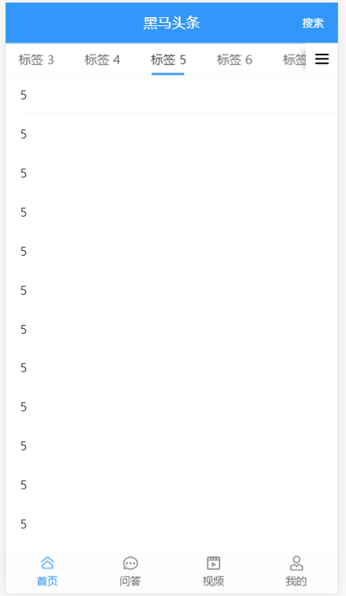
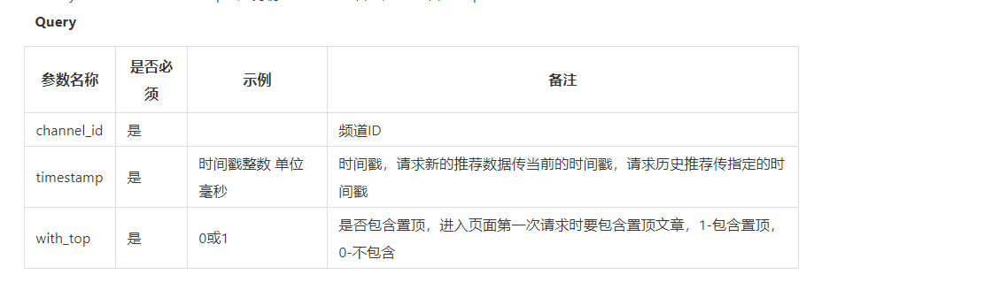
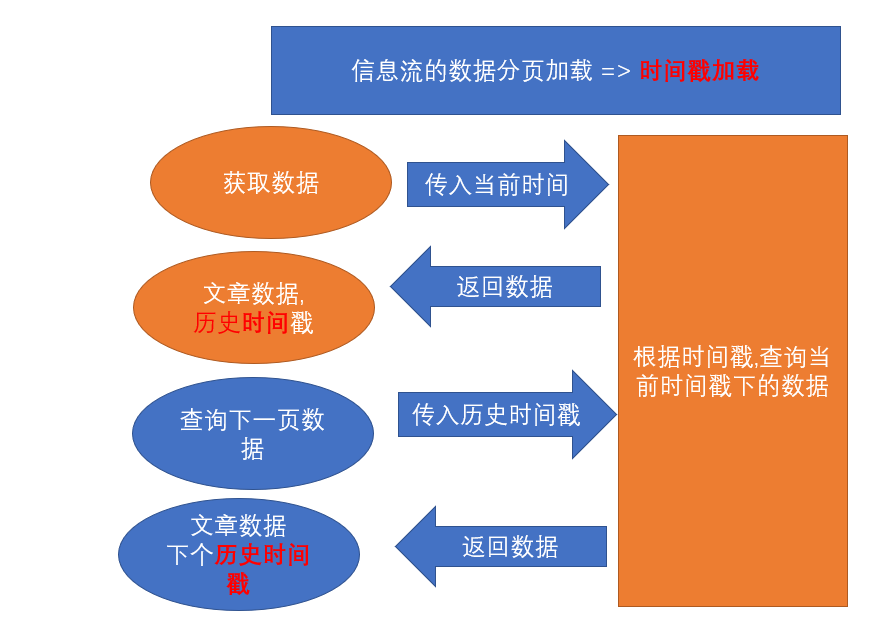

## 使用tabs组件

基础结构：



```html
 <div class="container">
    <van-tabs v-model="activeIndex" swipeable>
      <van-tab :title="'标签' +  item" v-for="item in 10" :key="item">
        <!-- 这里注意 这个div设置了滚动条 目的是 给后面做 阅读记忆 留下伏笔 -->
        <!-- 阅读记忆 => 看文章看到一半 滑到中部 去了别的页面 当你回来时 文章还在你看的位置 -->
        <div class='scroll-wrapper'>
          <van-cell-group>
            <van-cell v-for="obj in 20" :key="obj" :title="item"></van-cell>
          </van-cell-group>
        </div>
      </van-tab>
    </van-tabs>
    <span class="bar_btn">
      <van-icon name="wap-nav" />
    </span>
  </div>
```

设置样式：

```less
.van-tabs {
  height: 100%;
  display: flex;
  flex-direction: column;
  /deep/ .van-tabs__wrap {
    height: 36px;
    padding-right: 36px;
    .van-tab {
      line-height: 36px;
    }
    .van-tabs__line {
      background-color: #3296fa;
      height: 2px;
    }
  }
  /deep/ .van-tabs__content{
    flex: 1;
    overflow: hidden;
  }
  /deep/ .van-tab__pane{
    height: 100%;
    .scroll-wrapper{
      height: 100%;
      overflow-y: auto;
    }
  }
}
.bar_btn {
  width: 36px;
  height: 35px;
  position: absolute;
  top: 0;
  right: 0;
  &::before {
    content: "";
    width: 100%;
    height: 100%;
    position: absolute;
    z-index: 999;
    box-shadow: 0 0 10px #999;
    transform: scale(1, 0.6);
  }
  .van-icon-wap-nav {
    width: 100%;
    height: 100%;
    background: #fff;
    text-align: center;
    line-height: 35px;
    position: relative;
    z-index: 1000;
    &::before {
      font-size: 20px;
    }
  }
}
```

- vue组件中，在style设置为scoped的时候，里面在写样式对子组件是不生效的，如果想让某些样式对所以子组件都生效，可以使用 /deep/ 深度选择器。
- /deep/  作用：让样式在其他组件生效。
- 保证 scroll-wrapper 容器能够生成滚动条，将来需要使用滚动。
- 待实现功能
  - **`下拉刷新`**
  - **`上拉加载`**
  - **`记录浏览位置`**  => 阅读记忆

## 封装article-list组件

>   要封装一个 可以上拉加载和下拉刷新的组件

>频道下面对应的是列表, 一个频道对应一个列表

* [van-list](https://youzan.github.io/vant/#/zh-CN/list)

* List 组件通过`loading`和`finished`两个变量控制加载状态，当组件滚动到底部时，会触发`load`事件并将`loading`设置成`true`。此时可以发起异步操作并更新数据，数据更新完毕后，将`loading`设置成`false`即可。若数据已全部加载完毕，则直接将`finished`设置成`true`即可。

  **`注意:`** 我们要把之前的用的scroll-wrapper div也一同封装在 该组件里

  ```js
  <template>
   <!-- 这里注意 这个div设置了滚动条 目的是 给后面做 阅读记忆 留下伏笔 -->
   <!-- 阅读记忆 => 看文章看到一半 滑到中部 去了别的页面 当你回来时 文章还在你看的位置 -->
    <div class='scroll-wrapper'>
        <van-list v-model="upLoading" :finished="finished" @load="onLoad"></van-list>
    </div>
  </template>
  
  <script>
  export default {
    name: 'article-list',
    data () {
      return {
        upLoading: false, // 是否加载数据
        finished: false // 加载是否完成
      }
    },
    methods: {
      onLoad () {
      // 加载方法
        console.log('开始加载数据')
      }
    }
  
  }
  </script>
  
  <style>
  
  </style>
  
  ```

  >封装完成后,在 home下引入该组件,并完成注册,显示在主页上

* 在home中引入组件 并注册

     ```js
import ArticleList from './components/article-list'
 components: {
    ArticleList  // 注册组件
  },
  ```

* 在模板中应用

```html
<template>
  <div class="container">
    <van-tabs v-model="activeIndex" swipeable>
      <van-tab :title="'标签' +  item" v-for="item in 10" :key="item">
        <!-- 这里注意 这个div设置了滚动条 目的是 给后面做 阅读记忆 留下伏笔 -->
        <!-- 阅读记忆 => 看文章看到一半 滑到中部 去了别的页面 当你回来时 文章还在你看的位置 -->
         <ArticleList></ArticleList>
      </van-tab>
    </van-tabs>
    <span class="bar_btn">
      <van-icon name="wap-nav" />
    </span>
  </div>
</template>
```


## article-list实现上拉加载

* List 组件通过`loading`和`finished`两个变量控制加载状态，当组件滚动到底部时，会触发`load`事件并将`loading`设置成`true`。此时可以发起异步操作并更新数据，数据更新完毕后，将`loading`设置成`false`即可。若数据已全部加载完毕，则直接将`finished`设置成`true`即可。

>  在onLoad实现模拟生成数据 , 值得注意的是 上拉加载的数据是追加 ,每次加载的数据追加到原有数据的末尾
>
> 注意:  我们还需要在加载数据完毕后, 将原来的loading状态设置为 false

>van-list组件 ,当你的组件内容距离底部超过一定长度的时候,它就会自己调用我们的onLoad方法

```js
    onLoad () {
    // 加载方法
      setTimeout(() => {
        if (this.articles.length === 50) {
          // 停止追加
          this.finished = true
        } else {
          let arr = Array.from(Array(10), (value, index) => index + this.articles.length + 1)
          this.articles.push(...arr) // 把生成的数据追加到末尾
          this.upLoading = false // 关闭状态
        }
      }, 1000)
    }
```

>在上面的代码中, 我们设置了每个列表的数据上限50
>
>Array.from()方法就是将一个类数组对象或者可遍历对象转换成一个真正的数组。

页面结构：

```html
 <van-cell v-for="article in articles" :key="article" :title="article">
 </van-cell>
```
数据结构

```js
 upLoading: false, // 是否加载数据
 finished: false, // 加载是否完成
 articles: [] // 定义一个数组
```
## article-list实现下拉刷新

[PullRefresh](https://youzan.github.io/vant/#/zh-CN/pull-refresh)

下拉刷新时会触发 `refresh` 事件，在事件的回调函数中可以进行同步或异步操作，操作完成后将 `v-model` 设置为 `false`，表示加载完成。

> 下拉刷新组件 应该包裹 我们之前写的van-list组件 并且 给下拉刷新设置状态downLoading并且绑定事件onR

页面结构：

```html
<template>
  <!-- 这里注意 这个div设置了滚动条 目的是 给后面做 阅读记忆 留下伏笔 -->
  <!-- 阅读记忆 => 看文章看到一半 滑到中部 去了别的页面 当你回来时 文章还在你看的位置 -->
  <div class="scroll-wrapper">
    <van-pull-refresh v-model="downLoading" @refresh="onRefresh" :success-text="refreshSuccessText">
      <van-list v-model="upLoading" :finished="finished" @load="onLoad" finished-text="没有了">
        <van-cell v-for="article in articles" :key="article" :title="article"></van-cell>
      </van-list>
    </van-pull-refresh>
  </div>
</template>
```

数据：

```js
   refreshSuccessText: '更新成功', //  文本
   downLoading: false, // 是否开启下拉刷新
```

>模拟下拉刷新数据,注意 下拉刷新的数据应该 添加到原有数据的**`头部`**,并且要关闭加载状态	

模拟数据逻辑：

```js
    onRefresh () {
      // 触发下拉刷新
      console.log('下拉刷新')
      setTimeout(() => {
        let arr = Array.from(Array(10), (value, index) => ('追加' + (index + 1)))
        this.articles.unshift(...arr) // 将数据添加到队首
        this.downLoading = false // 关掉下拉状态
        this.refreshSuccessText = `更新了${arr.length}条数据`
      }, 1000)
    }
```


## article-列表文章布局

页面结构：

- 三张图

```html
<div class="article_item">
  <h3 class="van-ellipsis">PullRefresh下拉刷新PullRefresh下拉刷新下拉刷新下拉刷新</h3>
  <div class="img_box">
     <van-image class="w33" fit="cover" src="https://img.yzcdn.cn/vant/cat.jpeg"/>
     <van-image class="w33" fit="cover" src="https://img.yzcdn.cn/vant/cat.jpeg"/>
     <van-image class="w33" fit="cover" src="https://img.yzcdn.cn/vant/cat.jpeg"/>
  </div>
  <div class="info_box">
     <span>你像一阵风</span>
     <span>8评论</span>
     <span>10分钟前</span>
     <span class="close"><van-icon name="cross"></van-icon></span>
  </div>
</div>
```

- 一张图

```html
<div class="article_item">
  <h3 class="van-ellipsis">PullRefresh下拉刷新PullRefresh下拉刷新下拉刷新下拉刷新</h3>
  <div class="img_box">
      <van-image class="w100" fit="cover" src="https://img.yzcdn.cn/vant/cat.jpeg"/>
  </div>
  <div class="info_box">
     <span>你像一阵风</span>
     <span>8评论</span>
     <span>10分钟前</span>
     <span class="close"><van-icon name="cross"></van-icon></span>
  </div>
</div>
```

- van-ellipsis  vant内置的样式 当文本内容长度超过容器最大宽度时，自动省略多余的文本。
- w33   宽度33% 剩余1%当作间距。
- w100 宽度100% 


样式：

```less
.article_item{
  h3{
    font-weight: normal;
    line-height: 2;
  }
  .img_box{
    display: flex;
    justify-content: space-between;
    .w33{
      width: 33%;
      height: 90px;
    }
    .w100{
      width: 100%;
      height: 180px;
    }
  }
  .info_box{
    color: #999;
    line-height: 2;
    position: relative;
    font-size: 12px;                  
    span{
      padding-right: 10px;
      &.close{
        border: 1px solid #ddd;
        border-radius: 2px;
        line-height: 15px;
        height: 12px;
        width: 16px;
        text-align: center;
        padding-right: 0;
        font-size: 8px;
        position: absolute;
        right: 0;
        top: 7px;
      }
    }
  }
}
```


## 渲染真实的频道

>值得注意的是:  获取频道 用户可以不登录
>
>不强制用户登录，匿名用户返回后台设置的默认频道列表

api函数 `src/api/channels.js`

```js
// 专门处理频道的请求
import request from '@/utils/request'
/*
获取我的频道
**/
export function getMyChannels () {
  // 返回一个Promise  axios默认就是get类型
  return request({
    url: '/user/channels'

  })
}

```

导入函数 `src/vies/home/index.vue`

```js
import { getMyChannels } from '@/api/channel'
```

声明接收频道的数据

```js
 // ----频道需要的数据----
 channels: [],
```

使用函数 

```js
  methods: {
    async getMyChannels () {
      let data = await getMyChannels()
      this.channels = data.channels // 更新原来的channels
    }
  },
  created () {
    this.getMyChannels()
  }
```

渲染组件

```html
 <van-tabs v-model="activeIndex" swipeable>
      <van-tab :title="channel.name" v-for="channel in channels" :key="channel.id">
       <!-- 因为一个tab标签 对应一个article-list组件 -->
         <article-list></article-list>
      </van-tab>
  </van-tabs>
```


## 获取文章接口解析

>Feed信息流推荐接口 的加载采用了**`时间戳`**形式的加载模式
>
>时间戳是什么? 其实就是一个时间,只不过采用了毫秒级的计数






>加载到什么时候才结束? 加载到返回的历史时间戳 是 0的时候,表示再没有数据,这个时候可以把finished这个状态给关掉了 ,表示再也没有数据了

>那我们应该做什么 ?  
>
>接口要求的三个参数 channel_id / with_top / timestamp  我们必须准备好

* 一个一个来

>channel_id 频道id怎么来

当前频道可以拿到, 因为 home是article-list的父组件,可以通过props传递的方式传递过去

>with_top 怎么办

这个参数后端并没有实现,可以写死 为1

>timestamp 怎么生成 

```js
Date.now()  // 当前时间戳
```

## 文章列表-封装渲染列表方法

>需要注意的是,这里我用的地址是http://ttapi.research.itcast.cn/app/v1_1/articles 
>
>还记得 我们封装request 时 设置的baseURL吗,是http://ttapi.research.itcast.cn/app/v1_0
>
>所以 我们写请求时 得用完整的地址 ,否则就请求错了,	

- 封装api  `src/api/article.js`

```js
// 用于文章数据的获取

import request from '@/utils/request'
/**
 * 获取推荐文章的数据
 * axios中 query参数放置在 params上
 * body参数放置在data上
 * **/
export function getArticles (params) {
  return request({
    url: 'http://ttapi.research.itcast.cn/app/v1_1/articles',
    params: { with_top: 1, ...params }
  })
}

```

## 将channel_id传递给article_list和生成timestamp

> channel_id在 父组件 home中,涉及到props传值

这里介绍下props 传值  [props验证]([https://cn.vuejs.org/v2/guide/components-props.html#Prop-%E9%AA%8C%E8%AF%81](https://cn.vuejs.org/v2/guide/components-props.html#Prop-验证))

>原来我们经常写  props: ['属性名'] 来接收属性

这里介绍下 另一种写法,props也可以跟一个对象

```js
props: {
    // name是属性名
    name: {
        type: Number,  // type是指定的类型
        default: null   // default是默认值
        required: true  // 要求必须传该props属性 否则报错
    }
}
```

>  上面的过程,我们可以约束 必须给artcile-list传值,否则报错,因为 没有频道ID我们没有办法加载数据

* 接收频道id

```js
  props: {
    channel_id: {
      required: true,
      type: Number,
      default: null
    }
  },
```

* 传递数据

```html
 <ArticleList :channel_id="item.id"></ArticleList>
```

>接下来,定义一个 timestamp属性,用来存放时间戳

```js
timestamp: null
```

OK , 到现在一切OK,准备好了可加载数据了 ,接下来我们来实现  **`上拉加载`** onLoad  和 **`下拉刷新`** onRefresh两个方法

## 实现上拉加载  onLoad

>首先引入我们的请求模块, 注意这里应该在哪里引入呢,在article-list组件中引入

```js
import { getArticles } from '@/api/article'
```

>在onLoad中实现加载数据后,
>
>将数据追加到数据队尾,
>
>并且获取历史时间戳给timestamp,
>
>加载完毕 关闭加载状态 
>
>判断 是否有历史时间戳 没有的话 直接将finished关闭

第一次加载, 时间戳的是空的, 所以给当前时间戳

```js
async onLoad () {
      // 加载方法
      // setTimeout(() => {
      //   if (this.articles.length === 50) {
      //     // 停止追加
      //     this.finished = true
      //   } else {
      //     let arr = Array.from(
      //       Array(10),
      //       (value, index) => index + this.articles.length + 1
      //     )
      //     this.articles.push(...arr) // 把生成的数据追加到末尾
      //     this.upLoading = false // 关闭状态
      //   }
      // }, 1000)
      let data = await getArticles({ channel_id: this.channel_id, timestamp: this.timestamp || Date.now() })
      // 追加数据到队尾
      this.articles.push(...data.results)
      // 关闭加载状态
      this.upLoading = false
      if (data.pre_timestamp) {
        // 如果有
        this.timestamp = data.pre_timestamp
      } else {
        this.finished = true // 没有数据了
      }
    },
```

## 完成列表内容的动态渲染

>通过devtools可以发现,数据已经有了,此时你可以把原来的静态视图变成动态的,来一点成就感
>
>值得注意的是:  我们处理过大数字类型 ,超过长度的id会被转化成一个BigNumber类型,要想成为string,需要toString一下

```html
<div class="scroll-wrapper">
    <van-pull-refresh v-model="downLoading" @refresh="onRefresh" :success-text="refreshSuccessText">
      <van-list v-model="upLoading" :finished="finished" @load="onLoad" finished-text="没有了">
        <van-cell v-for="article in articles" :key="article.art_id.toString()">
          <div class="article_item">
            <h3 class="van-ellipsis">{{ article.title }}</h3>
            <div class="img_box" v-if="article.cover.type === 3">
              <van-image class="w33" fit="cover" :src="article.cover.images[0]" />
              <van-image class="w33" fit="cover" :src="article.cover.images[1]" />
              <van-image class="w33" fit="cover" :src="article.cover.images[2]" />
            </div>
            <div class="img_box" v-else-if="article.cover.type === 1">
              <van-image class="w100" fit="cover" :src="article.cover.images[0]" />
            </div>
            <div class="info_box">
              <span>{{ article.aut_name }}</span>
              <span>{{ article.comm_count }}评论</span>
              <span>{{ article.pubdate }}</span>
              <span class="close">
                <van-icon name="cross"></van-icon>
              </span>
            </div>
          </div>
        </van-cell>
      </van-list>
    </van-pull-refresh>
  </div>
```


## 实现下拉刷新  onRefresh

>下拉刷新要实现  用最新的时间戳 换取最新的数据
>
>这里的场景 大概分为两种 
>
>1. 拉取数据之后放在队首,后面的数据还在,  只有队首多了新的数据(这种模式是非Feed推荐模式的数据)
>2. 还有一种是 拉取新的数据之后,将当前的整个数据替换,往下拉,又是全新的, (这种是今日头条的实现模式)
>
>我们用今日头条的模式即可
>
>需要注意的是 ;有可能没有新数据推荐 ,没有数据推荐的话 就提示个没有数据更新 其他的不动就行

```js
    // 下拉刷新方法
    async onRefresh () {
      // 触发下拉刷新
      // console.log('下拉刷新')
      // setTimeout(() => {
      //   let arr = Array.from(Array(10), (value, index) => '追加' + (index + 1))
      //   this.articles.unshift(...arr) // 将数据添加到队首
      //   this.downLoading = false // 关掉下拉状态
      //   this.refreshSuccessText = `更新了${arr.length}条数据`
      // }, 1000)
      // 下拉刷新永远拉取的是最新的数据
      const data = await getArticles({ channel_id: this.channel_id, timestamp: Date.now() })
      this.downLoading = false // 关掉下拉状态
      // 有可能 最新没有推荐数据
      if (data.results.length) {
        // 如果长度大于0 表示有数据
        this.articles = data.results // 将历史数据全都覆盖掉了
        // 假如你之前 已经将 上拉加载设置成finished设置成true了
        // 表示 我们还需要继续往下拉 就需要把原来的状态再次打开
        this.finished = false
        // 注意我们依然需要获取此次的历史事件戳
        this.timestamp = data.pre_timestamp // 赋值历史时间戳 因为当你下拉刷新之后 上拉加载的时候 要用到这个历史事件戳
        this.refreshSuccessText = `更新了${data.results.length}条数据`
      } else {
      //  如果没有数据更新  什么都不需要变化
        this.refreshSuccessText = '已是最新数据'
      }
    }
```

## 延迟处理函数

>小技巧, 现在用户加载太快, 对服务器压力有点大,可以让用户的请求别那么快发出去,可以自己封装一个小休眠函数

```js
export default {
  // Vue.use(obj) => 会调用obj 中的install方法
  install (Vue) {
    //   插件
    Vue.prototype.$gnotify = (params) => Vue.prototype.$notify({ duration: 800, ...params }) // 小伎俩
    Vue.prototype.$sleep = sleep
  }
}
function sleep (time = 500) {
  return new Promise(function (resolve, reject) {
    setTimeout(() => resolve(), time)
  })
}

```

* 在上拉加载 和下拉刷新的过程中 进行应用

```js
await this.$sleep()
```


## 时间格式处理

>我们的时间显示的有点问题,应该显示类似 1个月内,3天内,一年内 等所谓的相对时间,  这里可以采用 dayjs这个插件
>
>[dayjs](https://www.npmjs.com/package/dayjs)
>
>值得注意的是:  dayjs的相对时间的使用方式,需要扩展一个自身的功能

>  安装dayjs插件

```bash
$ npm i dayjs -S
$ yarn add dayjs 
```

>  封装一个相对时间函数

```js
import dayjs from 'dayjs'
import 'dayjs/locale/zh-cn'
import relativeTime from 'dayjs/plugin/relativeTime'

dayjs.extend(relativeTime)
```

```js
// 转化时间到相对时间
function relTime (date) {
  return dayjs().locale('zh-cn').from(date)
}
```

> 注册成过滤器

```diff
export default {
  install (Vue) {
    Vue.prototype.$sleep = sleep
    Vue.filter('relTime', relTime)
  }
}
```

使用：

```html
<span>{{ article.pubdate | relTime }}</span>
```


## 图片懒加载

>假如当前有10条数据,都有图片,那么这些图片都会被立刻请求过来,我们希望 只有当图片出来的时候,才去加载这些图片

>  我们可以使用[van-image](https://youzan.github.io/vant/#/zh-CN/image)组件属性  需要配合lazyload

* 设置`lazy-load`属性来开启图片懒加载，需要搭配 [Lazyload](https://youzan.github.io/vant/#/zh-CN/lazyload) 组件使用

```html
<van-image lazy-load></van-image>
```

- 需要依赖 v-lazy 指令

* 导入lazyload，注册，实现图片懒加载。

```js
import Vant, { Lazyload } from 'vant'
```

```js
// 注册好了 支持v-lazy指令
Vue.use(Lazyload)
```

OK,目前你的图片就是懒加载了 可以通过 F12进行调试


## 更多操作-组件准备

> 我们要做一个反馈组件,可以反馈新闻,并且举报
>
> 我们通过点击新闻列表的叉号来进行反馈,但是这个叉号 我们如果没有登录的情况下 ,不应该显示

在组件中引入vuex数据,根据状态判断 是否显示 **`叉号`**

```vue
import { mapState } from 'vuex'
 
  computed: {
    ...mapState(['user'])
  },
  <span class="close" v-if="user.token">
         <van-icon name="cross"></van-icon>
   </span>
```

>OK,我们继续,我们在点击叉号的时候,要弹出一个层,层里是若干内容, 这个组件,我们可以继续封装

home下components下 新建一个moreAction的组件

- 封装在 `./components/more-action.vue` 组件下

```html
<template>
  <div class="more-action">
    <van-cell-group v-if="!isReport">
      <van-cell>不感兴趣</van-cell>
      <van-cell is-link @click="isReport=true">反馈垃圾内容</van-cell>
      <van-cell>拉黑作者</van-cell>
    </van-cell-group>
    <van-cell-group v-else>
      <van-cell icon="arrow-left" @click="isReport=false">返回</van-cell>
      <van-cell>侵权</van-cell>
      <van-cell>色情</van-cell>
      <van-cell>暴力</van-cell>
      <van-cell>低俗</van-cell>
      <van-cell>不适</van-cell>
      <van-cell>错误</van-cell>
      <van-cell>其他</van-cell>
    </van-cell-group>
  </div>
</template>

<script>
export default {
  data () {
    return {
      isReport: false
    }
  }
}
</script>

<style lang='less' scoped>
.more-action {
  border-radius: 4px;
}
</style>


```

>那么这个more-action在哪里引入呢?  我们需要知道,我们的acticle-list并不是只有一个组件实例,而是有多少个 频道就有多少个artcile-list,如果我们想节约一下组件实例的开销,可以在 home组件中使用这个组件, 使用
>
>子组件  => 调用父组件方法的形式 来触发 反馈

* OK,我们直接在父组件中引入反馈组件,并且完成注册

```js
import MoreAction from './components/more-action'
```

```js
components: { MoreAction },
```

>问题又来了,我们需要弹层来弹出这个组件 ,这个时候我们采用 [pop-up组件](https://youzan.github.io/vant/#/zh-CN/popup)

>我们用popup组件来包裹 MoreAction组件就可以弹出层拉

```html
<van-popup :style="{ width: '80%' }" v-model="showMoreAction">
      <more-action ></more-action>
    </van-popup>
```

>popup组件需要 绑定一个showMoreAction变量来控制显示隐藏

```js
showMoreAction: false  // 控制反馈组件显示隐藏
```

>这个时候,我们就要在子组件中注册 点击叉号的事件,并且告诉父组件,我要反馈

* 子组件触发自定义事件

```html
 <span class="close" v-if="user.token" @click="$emit('showMoreAction')">
```

* 父组件监听自定义事件,并且弹出层

```html
 <ArticleList @showMoreAction="openMoreAction" :channel_id="item.id"></ArticleList>
```

```js
openMoreAction () {
      this.showMoreAction = true
 }
```

>OK,还没完,不感兴趣接口  和 举报接口 分别需要我们提供参数

* 举报文章 需要 文章id和 举报类型

| target | integer | 必须   |      | 举报的文章id                                                 |      |
| ------ | ------- | ------ | ---- | ------------------------------------------------------------ | ---- |
| type   | integer | 必须   |      | 举报类型： 0-其他问题，1-标题夸张，2-低俗色情，3-错别字多，4-旧闻重复，5-广告软文，6-内容不实，7-涉嫌违法犯罪，8-侵权' |      |
| remark | string  | 非必须 |      | 其他问题 的附加说明                                          |      |

* 不感兴趣接口 需要提供文章id

  | 名称   | 类型    | 是否必须 | 默认值 | 备注           | 其他信息 |
  | ------ | ------- | -------- | ------ | -------------- | -------- |
  | target | integer | 必须     |        | 不喜欢的文章id |          |

>所以我们需要点击叉号的时候 把文章id传出来,并且在父组件中接收 存储

* 传出值

```html
  <span class="close" v-if="user.token" @click="$emit('showAction', article.art_id.toString())">
                <van-icon name="cross"></van-icon>
     </span>
```

* 接收存储值

```js
 articleId: null // 定义一个值接收
    openMoreAction (artId) {
      // 打开弹层
      this.showMoreAction = true
      this.articleId = artId
    }
```

OK了,我们可以做接口的封装了


## 更多操作-不感兴趣接口

>首先封装 不感兴趣的api

- 封装API `src/api/article.js`

```js
/***
 * 不喜欢文章接口
 * ***/
export function disLikeArticle (data) {
  return request({
    url: '/article/dislikes',
    method: 'post',
    data
  })
}

```

>然后找到不感兴趣的按钮 触发自定义事件 告诉父组件,不感兴趣

```html
<van-cell @click="$emit('dislike')">不感兴趣</van-cell>
```

>父组件 监听该事件, 调用不喜欢接口

```html
 <more-action @dislike="dislike"></more-action>
```

>调用接口 提示成功

```js
    // 不喜欢文章
    async dislike () {
      try {
        if (this.articleId) {
          await disLikeArticle({
            target: this.articleId
          })
          this.$gnotify({ type: 'success', message: '操作成功' })
        }
      } catch (error) {
        this.$gnotify({ type: 'danger', message: '操作失败' })
      }
    }
```

>结束了吗? 没有!!!首先 应该关闭弹层, 这个好说 但是 我们应该把不喜欢的文章给删除掉 怎么办?

>我们知道home是父组件,但是数据存在 子组件中,父组件并没有办法直接删除子组件的数据 怎么办?

>学没学过eventBus ,可不可以 在父组件中发广播, 子组件接收广播,然后找有没有对应文章id的数据,有的话就删掉!!!

* 首先封装一个eventBus

```js
import Vue from 'vue'
export default new Vue()
```

* 然后在父组件中触发一个事件 ,传入当前的channelId,因为我们只想让对应的频道下的数据删除

```js
  // 不喜欢文章
    async dislike () {
      try {
        if (this.articleId) {
          await disLikeArticle({
            target: this.articleId
          })
          this.$gnotify({ type: 'success', message: '操作成功' })
          eventBus.$emit('delArticle', this.articleId, this.channels[this.activeIndex].id)
          this.showMoreAction = false
        }
      } catch (error) {
        this.$gnotify({ type: 'danger', message: '操作失败' })
      }
    }
```

* 子组件中监听该事件,并判断是否是自己下面的数据 ,找到删除

```js
  created () {
    // 开启监听
    eventBus.$on('delArticle', (articleId, channelId) => {
      if (this.channel_id === channelId) {
        // 这个条件表示 该列表就是当前激活的列表
        let index = this.articles.findIndex(item => item.art_id.toString() === articleId) // 查找对应的文章
        // 如果index大于 -1 表示找到了 就要删除
        if (index > -1) {
          this.articles.splice(index, 1) // 删除不喜欢的文章
        }
      }
    })
  },
```

OK,终于大功告成

## 更多操作-举报文章

> 举报文章和 不喜欢类似, 流程基本一致 ,但是我们需要定义一些常量

- 根据接口提供的传参，定义常量数据 `src/api/constants.js`

```js

// 举报类型： 0-其他问题，1-标题夸张，2-低俗色情，3-错别字多，4-旧闻重复，5-广告软文，6-内容不实，7-涉嫌违法犯罪，8-侵权'
export const reports = [{
  value: 0,
  label: '其他问题'
}, {
  value: 1,
  label: '标题夸张'
}, {
  value: 2,
  label: '低俗色情'
}, {
  value: 3,
  label: '错别字多'
}, {
  value: 4,
  label: '旧闻重复'
}, {
  value: 5,
  label: '广告软文'
}, {
  value: 6,
  label: '内容不实'
}, {
  value: 7,
  label: '涉嫌违法犯罪'
}, {
  value: 8,
  label: '侵权'
}]

```

>  使用数据循环生成 举报类型

```js
import { reports } from '@/api/constants'
```

```diff
  data () {
    return {
      isReport: false,
+     reports
    }
  },
```

```html
<van-cell icon="info-o" v-for="item in reports" :key="item.value">
  {{item.label}}
</van-cell>
```

> 封装举报api  `src/api/article.js`

```js
/** **封装一个举报文章的API*****/
export function reportArticle (data) {
  return request({
    url: '/article/reports',
    data,
    method: 'post'
  })
}
```

> 绑定点击事件,触发自定义事件,需要传出选择的举报类型

```html
 <van-cell icon="info-o" @click="$emit('report', item.value)" v-for="item in reports" :key="item.value">{{ item.label }}</van-cell>

```

>父组件同样需要监听该事件,处理流程 同不喜欢文章一样, 可以通过 封装抽提 将两个方法 合成一个

```js
    // 不喜欢文章或者举报文章
    async dislikeOrReport (params, operatetype) {
      try {
        if (this.articleId) {
          operatetype === 'dislike'
            ? await disLikeArticle({
              target: this.articleId
            }) : await reportArticle({
              target: this.articleId,
              type: params
            })
          this.$gnotify({ type: 'success', message: '操作成功' })
          eventBus.$emit('delArticle', this.articleId, this.channels[this.activeIndex].id)
          this.showMoreAction = false
        }
      } catch (error) {
        this.$gnotify({ type: 'danger', message: '操作失败' })
      }
    }
```

```html
    <van-popup :style="{ width: '80%' }" v-model="showMoreAction">
      <more-action @dislike="dislikeOrReport($event,'dislike')" @report="dislikeOrReport($event,'report')"></more-action>
    </van-popup>
```


>还有个小问题 ,我们发现 举报之后,再次进行反馈,状态还是之前的, 我们可以 同样的再MoreAction中监听 删除文章 事件, 然后 重置 我们的显示状态

```js
  created () {
    eventBus.$on('delArticle', () => (this.isReport = false)) // 重置状态
  }
```


