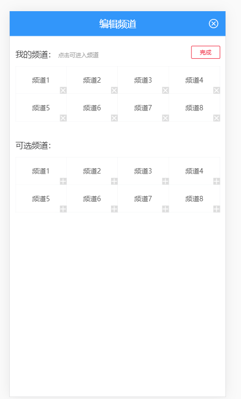
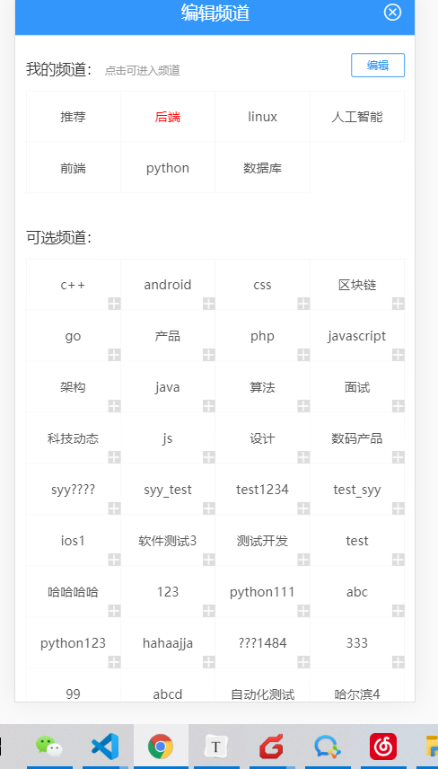

## 频道管理-准备组件

>同样在home下 新建一个组件 channel-edit.vue

```html
<template>
  <div class="channel-edit">
    <div class="channel">
      <div class="tit">
        我的频道：
        <span class="tip">点击可进入频道</span>
        <van-button v-if="!editing" @click="editing=true" size="mini" type="info" plain>编辑</van-button>
        <van-button v-else @click="editing=false" size="mini" type="danger" plain>完成</van-button>
      </div>
      <van-grid class="van-hairline--left">
        <van-grid-item v-for="index in 8" :key="index">
          <span class="f12">频道{{index}}</span>
          <van-icon class="btn" name="cross"></van-icon>
        </van-grid-item>
      </van-grid>
    </div>
    <div class="channel">
      <div class="tit">可选频道：</div>
      <van-grid class="van-hairline--left">
        <van-grid-item v-for="index in 8" :key="index">
          <span class="f12">频道{{index}}</span>
          <van-icon class="btn" name="plus"></van-icon>
        </van-grid-item>
      </van-grid>
    </div>
  </div>
</template>

<script>
export default {
  data () {
    return {
      editing: false
    }
  }
}
</script>

<style lang='less' scoped>
.channel-edit {
  .channel {
    padding: 10px;
    .tit {
      line-height: 3;
      .tip {
        font-size: 10px;
        color: #999;
      }
    }
    .van-button {
      float: right;
      margin-top: 7px;
    }
    .btn {
      position: absolute;
      bottom: 0;
      right: 0;
      background: #ddd;
      font-size: 12px;
      color: #fff;
    }
    .f12 {
      font-size: 12px;
      color: #555;
    }
    .red {
      color: red;
    }
  }
}
</style>

```

>  在home中引入使用组件：`src/views/home/index.vue`, 该组件放置在弹层面板 
>
> [van-action-sheet](https://youzan.github.io/vant/#/zh-CN/action-sheet)中,通过v-model绑定显示隐藏

> 定义一个变量 来控制显示隐藏

```js
showChannelEdit: false
```

```html
<van-action-sheet :round="false" title="编辑频道" v-model="showChannelEdit">
      <channel-edit></channel-edit>
 </van-action-sheet><channel-edit v-model="showChannelEdit"></channel-edit>
```

>注册图标的点击事件, 显示编辑频道面板

```html
    <span class="bar_btn" @click="showChannelEdit=true">
      <van-icon name="wap-nav" />
    </span>
```


>在父组件中设置一下面板的样式

```css
.van-action-sheet {
  max-height: 100%;
  height: 100%;
  .van-action-sheet__header {
    background: #3296fa;
    color: #fff;
    .van-icon-close {
      color: #fff;
    }
  }
}
```

   

## 渲染我的频道

>我的频道数据在home组件中,可以直接用props传递给channel_edit组件

```html
    <van-action-sheet :round="false" title="编辑频道" v-model="showChannelEdit">
      <channel-edit :channels="channels"></channel-edit>
    </van-action-sheet>
```

>子组件接收props数据

```js
  props: {
    channels: {
      required: true,
      type: Array,
      default: () => []
    }
  }
```

- 接收父组件数据  `src/views/home/components/channel-edit.vue`

>循环渲染,并且处理叉号显示的问题, 并且第一个永远不允许删除

```html
<div class="channel-edit">
    <div class="channel">
      <div class="tit">
        我的频道：
        <span class="tip">点击可进入频道</span>
        <van-button v-if="!editing" @click="editing=true" size="mini" type="info" plain>编辑</van-button>
        <van-button v-else @click="editing=false" size="mini" type="danger" plain>完成</van-button>
      </div>
      <van-grid class="van-hairline--left">
        <van-grid-item v-for="(item,i) in channels" :key="item.id">
          <span class="f12">{{ item.name }}</span>
          <template v-if="i!==0">
            <van-icon v-show="editing" class="btn" name="cross"></van-icon>
          </template>
        </van-grid-item>
      </van-grid>
    </div>
    <div class="channel">
      <div class="tit">可选频道：</div>
      <van-grid class="van-hairline--left">
        <van-grid-item v-for="index in 8" :key="index">
          <span class="f12">频道{{index}}</span>
          <van-icon class="btn" name="plus"></van-icon>
        </van-grid-item>
      </van-grid>
    </div>
  </div>
```


## 渲染可选频道

>可选频道是 所有的频道 减去 目前自己的频道,所以首先应该先获取所有系统频道

- 获取所有频道API `src/api/channel.js`

```js
/***
 * 获取所有频道
 * ***/
export function getAllChannels () {
  return request({
    url: '/channels'
  })
}


```

- 组件中调用API

```js
methods: {
    async getAllChannels () {
      let data = await getAllChannels()
      this.allChannels = data.channels
    }               
}
```

```js
  created () {
    this.getAllChannels()
  }
```

- 可选频道 = 全部频道 - 我的频道

```js
  computed: {
    // 可用频道
    optionalChannels () {
      return this.allChannels.filter(item => !this.channels.some(o => o.id === item.id))
    }
  }
```

- 渲染

```html
    <div class="channel">
      <div class="tit">可选频道：</div>
      <van-grid class="van-hairline--left">
        <van-grid-item v-for="channel in optionalChannels" :key="channel.id">
          <span class="f12">{{ channel.name }}</span>
          <van-icon class="btn" name="plus"></van-icon>
        </van-grid-item>
      </van-grid>
    </div>
```

## 点击我的频道,进入频道

>这个功能 需要注册我的频道的点击事件,
>
>将点击的频道id传给 父组件,
>
>父组件根据id找到对应的索引,
>
>切换tab页索引到对应的tab页下

> 首先点击频道触发自定义事件

```html
<span @click="$emit('selectChannel', channel.id)" class="f12">{{channel.name}}</span>
```

>父组件监听这个事件

```html
  <van-action-sheet :round="false" title="编辑频道" v-model="showChannelEdit">
      <channel-edit @selectChannel="selectChannel" :channels="channels"></channel-edit>
    </van-action-sheet>
  </div>
```

```js
    // 切换到对应的频道 关闭弹层
    selectChannel (id) {
      let index = this.channels.findIndex(item => item.id === id) // 获取切换频道的索引
      this.activeIndex = index // 将tabs激活标签切换到对应的标签下
      this.showChannelEdit = false // 关闭弹层
    },
```

## 频道编辑中显示当前频道

> 进入频道编辑 我们并不知道  当前谁被选中了,但是父组件home中一个activeIndex记录了当前激活的索引,
>
> 这个索引可以帮助我们在编辑组件中找到对应 的频道

* 首先props传值 

```html
  <van-action-sheet :round="false" title="编辑频道" v-model="showChannelEdit">
      <channel-edit :activeIndex="activeIndex" @selectChannel="selectChannel" :channels="channels"></channel-edit>
    </van-action-sheet>
```

* props接收

  ```js
      activeIndex: {
        type: Number
      }
  ```

* 比对索引,给当前频道 加一个激活样式

  ```html
  <span :class="{red: i === activeIndex}" class="f12" @click="$emit('selectChannel',item.id)">{{ item.name }}</span>
  
  ```

> 得到如下效果 OK了
>
> 

## 重构我的频道API

> OK ,到了一个**`比较难`**的地方,目前频道的编辑接口存在着一些问题,所以我们尝试 将问题简单化

> 我们尝试将所有个人的频道 不论是登录还是没登录的 都进行本地化,什么意思呢

>如果是游客, 第一次会查询到默认的频道,我们将这个默认频道 **`缓存到本地.`**,如果要修改 就可以修改本地的这个缓存, 那么以后进来的时候, 如果能确定游客身份, 就先去本地查频道 , 如果能查到 ,就用本地频道,否则查询线上频道

>如果是登录用户, 第一次查到默认的频道也**`缓存到本地`**, 但是这个缓存 **`和游客的缓存区分`**,如果修改也修改本地的缓存,以后再次进来 ,就从缓存中先读取,如果 能读到,就用本地的,否则用查询的数据


我们需要对获取个人频道的数据进行改造,

>还需要注意,我们读取缓存数据的时候还需要 区分 游客和登录

- 兼容本地存储

```js
import store from '@/store'
// 本地缓存 需要key
const CACHE_CHANNEL_T = 'hm-91-toutiao-t' // 游客缓存的key
const CACHE_CHANNEL_U = 'hm-91-toutiao-u' // 登录用户的key
/*
获取我的频道
**/
export function getMyChannels () {
  // 返回一个Promise  axios默认就是get类型
  // 首先我们应该 先从缓存中读取 看看缓存中没没有 如果缓存中有的话 用缓存的数据 如果缓存中没有 才去查询
  // return request({
  //   url: '/user/channels'
  // })
  return new Promise(async function (resolve, reject) {
    // 做我们的逻辑
    let key = store.state.user.token ? CACHE_CHANNEL_U : CACHE_CHANNEL_T // 用于缓存的key
    // 从缓存中读取数据
    let str = localStorage.getItem(key) // 得到缓存结果
    if (str) {
      //  如果str存在 表示缓存中有数据
      resolve({ channels: JSON.parse(str) }) // 表示从缓存中获取的数据 通过执行链下发给下一个promise
    } else {
      // 如果没有数据
      const data = await request({ url: '/user/channels' }) // 从线上拉取数据
      localStorage.setItem(key, JSON.stringify(data.channels)) // 将线上数据写入缓存
      resolve(data) // 将线上获取的数据释放下给promise
    }
  })
}

```

- 注意：

  - 本地存储，返回数据格式，和后端保存一致。

  

## 删除我的频道API

>OK,上一步,我们彻底将数据进行了本地化,那么删除频道其实就可以完全本地化

* 封装本地化 删除API

```js
/****
 *删除频道
 * ***/
export function delChannel (id) {
  return new Promise(function (resolve, reject) {
    // 首先也需要做判断  是删除 游客的频道还是删除登录的频道
    let key = store.state.user.token ? CACHE_CHANNEL_U : CACHE_CHANNEL_T // 用于缓存的key
    let channels = JSON.parse(localStorage.getItem(key)) // 得到缓存结果 缓存中一定是有数据的
    let index = channels.findIndex(item => item.id === id) // 找到对应频道的索引
    if (index > -1) {
      // 删除数据
      channels.splice(index, 1) // 直接删除原数组中的数据  第一种方式
      // channels = channels.filter(item => item.id !== id) // 新数组模式去除要删除的频道 第二种方式
      // 应该重新写入缓存
      localStorage.setItem(key, JSON.stringify(channels)) // 重新写入 缓存
      resolve()
    } else {
      reject(new Error('找不到对应的频道'))
    }
  })
}
```


## 删除我的频道功能

>删除频道需要注册频道删除按钮的事件,调用父组件来统一删除,并且需要根据当前删除频道 来决定激活tab的切换

> 先给删除按钮 注册事件 触发自定义事件 传出 删除的频道id
>
> 子  => 父

```html
<van-icon @click="$emit('delChannel', channel.id)"  v-show="editing" class="btn" name="cross"></van-icon>
```

>父组件需要监听这个事件,并调用删除API进行本地化删除,删除完成移除自身的数据,通过props影响 频道编辑组件

> 监听子组件触发的事件

```html
    <van-action-sheet :round="false" title="编辑频道" v-model="showChannelEdit">
      <channel-edit @delChannel="delChannel" :activeIndex="activeIndex" @selectChannel="selectChannel" :channels="channels"></channel-edit>
    </van-action-sheet>
```

>实现删除本地频道并切换索引及删除自身数据

```js
    // 删除频道的方法
    async delChannel (id) {
      try {
        await delChannel(id) // 表示删除数据成功
        // 要移除自身data中channels中的数据
        let index = this.channels.findIndex(item => item.id === id) // 找到删除的索引
        if (index <= this.activeIndex) {
          // 如果删除的频道在当前激活频道之前或者就是当前激活频道
          // 要把我们的激活索引往前挪一位
          this.activeIndex = this.activeIndex - 1
        }
        if (index > -1) {
          //  如果大于-1
          this.channels.splice(index, 1) // 移除当前频道
        }
      } catch (error) {
        this.$gnotify({ type: 'danger', message: '删除频道失败' })
      }
    },
```

> OK, 应该大功告成


## 添加我的频道API

>剩下最后一个功能,添加频道,先封装一个API方法, 套路一样,也是本地化添加

```js
// 添加频道
// 添加频道

export function addChannel (channel) {
  return new Promise(function (resolve, reject) {
    // 添加逻辑
    // 首先也需要做判断  是删除 游客的频道还是删除登录的频道
    let key = store.state.user.token ? CACHE_CHANNEL_U : CACHE_CHANNEL_T // 用于缓存的key
    let channels = JSON.parse(localStorage.getItem(key)) // 得到缓存结果 缓存中一定是有数据的
    channels.push(channel) // 将频道添加到队尾
    // 重新写入缓存
    localStorage.setItem(key, JSON.stringify(channels)) // 写入缓存
    resolve() // 释放成功
  })
}
```

## 添加到我的频道

>OK,最后一步, 添加到我的频道, 首先要给可选频道的加号注册事件 ,然后和删除频道一样的套路 ,通过自定义事件触发,通知给父组件,让父组件来完成此操作

- 绑定事件，提供（添加频道）数据。

```html
<van-icon class="btn" name="plus" @click="$emit('addChannel',channel)"></van-icon>
```

- 父组件监听这个事件,并且完成添加逻辑

```html
  <channel-edit @addChannel="addChannel" @delChannel="delChannel" :activeIndex="activeIndex" @selectChannel="selectChannel" :channels="channels"></channel-edit>

```

* 添加逻辑

```js
  // 添加频道
    async  addChannel (channel) {
      await addChannel(channel)
      this.channels.push(channel) // 自身加一个频道 影响子组件
    }
```


