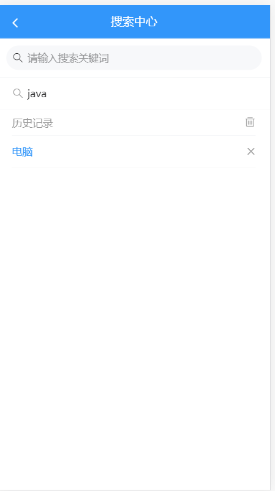
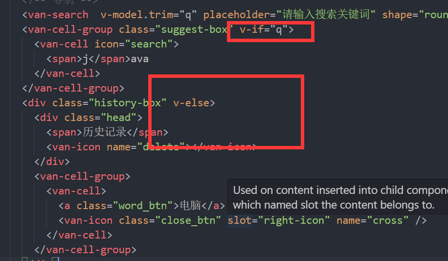

## 搜索中心-基础布局

> 首先完成搜索中心的基础布局




```vue
<template>
  <div class="container">
    <!-- 搜索组件一级路由   返回上一个页面-->
    <van-nav-bar left-arrow title="搜索中心" @click-left="$router.back()"></van-nav-bar>
    <!-- 导航 -->
    <van-search  placeholder="请输入搜索关键词" shape="round" />
    <van-cell-group class="suggest-box" >
      <van-cell icon="search">
        <span>j</span>ava
      </van-cell>
    </van-cell-group>
    <div class="history-box">
      <div class="head">
        <span>历史记录</span>
        <van-icon name="delete"></van-icon>
      </div>
      <van-cell-group>
        <van-cell>
          <a class="word_btn">电脑</a>
          <van-icon class="close_btn" slot="right-icon" name="cross" />
        </van-cell>
      </van-cell-group>
    </div>
  </div>
</template>

<script>
export default {
  name: 'search'
}
</script>

<style lang='less' scoped>
.history-box {
  padding: 0 20px;
  .head{
    line-height: 36px;
    color: #999;
    .van-icon{
      font-size: 16px;
      float: right;
      margin-top: 10px;;
    }
  }
  .van-cell{
    padding: 10px 0;
  }
  .word_btn{
    color:#3296fa;
  }
  .close_btn{
    margin-top:5px;
    color: #999;
  }
}
.suggest-box{
  /deep/ .van-cell{
    padding: 10px 20px;
    color: #999;
    p{
      span{
        color: red;
      }
    }
  }
}
</style>

```

## 搜索关键词 和历史记录及联想搜索

> 首先应该给搜索框绑定一个数据,来获取搜索的内容

```js
export default {
  name: 'search',
  data () {
    return {
      q: ''
    }
  }
}
```

> 然后完成搜索框和数据的绑定

```html
 <van-search  v-model.trim="q" placeholder="请输入搜索关键词" shape="round" />
```

如果想自动过滤前后空格,可以给v-model一个修饰符 **`trim`**

>什么时候出现联想搜索, ? 什么时候出现 历史记录 ? 
>
>应该是有输入内容时  =>联想 
>
>没内容时  => 历史记录

so =>进行一下 判断显示




## 搜索中心-历史记录

术语解释

埋点: 电商/新闻/视频/交友...  都有埋点 

> 埋点就是 在 一些页面的关键部位,加一个程序,记录用户操作的次数 以及行为, 将这些数据记录下来

埋点数据最终用 报表 图表呈现,最终给公司决策层使用,一般使用第三方的软件 

神策数据 / 友盟  => 集成 神策和友盟的工具,调用神策和友盟的api方法


> 历史记录 我们依然用本地化来做,思路是 初始化的时候 去查一下本次缓存,然后把历史记录给我们组件的属性

> 首先定义一个历史记录数据

```js
historyList: []
```

>定义一个key,用来存储历史记录到本地缓存

```js
const key = 'hm-94-toutiao-history' // 此key用来作为 历史记录在本地缓存中的key
```

>读取数据

```js
  created () {
    this.historyList = JSON.parse(localStorage.getItem(key) || '[]')
  }
```

或者是 直接 在 data初始时  从缓存中读取数据

```js
  data () {
    return {
      q: '', // 关键字的数据
      // 当data初始化的时候 会读取后面数据
      historyList: JSON.parse(localStorage.getItem(key) || '[]')// 作为一个数据变量 接收 搜索历史记录
    }
  }
```


- 有历史记录数据才显示历史记录

```html
<div class="history-box" v-else-if="historyList.length">
```

- 渲染 , 根据 当前的历史记录渲染出页面

```html
    <div class="history-box" v-else>
      <!-- 只有当历史记录存在的时候 才显示头部 -->
      <div class="head" v-if="historyList.length">
        <span>历史记录</span>
        <van-icon name="delete"></van-icon>
      </div>
      <van-cell-group>
        <!-- 需要把 这个位置变成动态的 -->
        <van-cell v-for="(item,index) in historyList" :key="index">
          <!-- 显示循环内容 -->
          <a class="word_btn">{{ item }}</a>
          <van-icon class="close_btn" slot="right-icon" name="cross" />
        </van-cell>
      </van-cell-group>
    </div>
```

- 删除

```html
 <van-icon @click="delHistory(index)" class="close_btn" slot="right-icon" name="cross" />
```

```js
  methods: {
    // 删除历史
    delHistory (index) {
      // 删除要先在data中删除数据 然后把data中的数据同步到 本地缓存中
      this.historyList.splice(index, 1) // 直接删除对应的历史记录数据
      // 将数据同步到 本地缓存
      localStorage.setItem(key, JSON.stringify(this.historyList))
    }
  }
```

- 根据历史去搜索=>点击历史记录时,跳到搜索结果

```html
 <van-cell @click="toSearchResult(text)" v-for="(item,index) in historyList" :key="index">
     <a class="word_btn">{{ item }}</a>
     <van-icon @click.stop="delHistory(index)" class="close_btn" slot="right-icon" name="cross" />
   </van-cell>
```

```js
    // 跳到搜索结果页
    toSearchResult (text) {
      // 跳转到搜索结果页?
      // this.$router 路由对象实例
      // this.$route 当前的路由页面对象信息  当前地址 params参数  query参数 fullPath
      // 路由传参 params query
      //   this.$router.push('/search/result?q=' + text) // 采用query传递参数  地址拼接参数
      this.$router.push({ path: '/search/result', query: { q: text } })
    }
```

- 清空操作

```html
 <van-icon name="delete" @click="clear"></van-icon>
```

```js
    // 清空历史记录
    async clear () {
      // 直接清空历史记录
      // 一般来说 删除所有内容之前
      // 本身也支持promise
      try {
        await this.$dialog.confirm({
          title: '提示',
          message: '您确定要删除所有历史记录吗'
        })
        // 会执行下面的代码
        this.historyList = [] // 将本地历史记录设置为空
        localStorage.setItem(key, '[]') // 同步设置历史记录为空
      } catch (error) {
        // 失败不需要处理
      }
    }
```

* 搜索按钮,回车或者虚拟键盘搜索  => 搜索事件

```js
    onSearch () {
      // 首先判断的搜索内容为空 为空 直接返回
      if (!this.q) return
      // 应该在跳转之前 应该把搜索的结果 添加到历史记录
      // 这里要去重 set
      this.historyList.push(this.q) // 将搜索内容加入到历史记录
      this.historyList = Array.from(new Set(this.historyList)) // 去重
      localStorage.setItem(key, JSON.stringify(this.historyList)) // 设置到本地缓存
      // 搜索事件触发的时候 应该跳到 搜索结果页 并且携带 参数
      this.$router.push({ path: '/search/result', query: { q: this.q } })
    }
```


## 搜索中心-联想搜索

>联想搜索 是 根据当前输入的值 进行实时查询 首先封装对应的API

- 封装API   `src/api/articles.js`

```js
/*****
 * 获取联想搜索建议
 * ***/
export function getSuggestion (params) {
  return request({
    url: '/suggestion', // 搜搜建议地址
    params // query参数放置在 params中
  })
}

```

> 监听 关键字 改变，进行联想补全。但是我们尝试在watch中去监听q的变化,会发现一些问题
>
> 值改变事件  => 频繁触发一个函数 =>降低触发函数的频率

>但是在进行联想搜索之前,我们首先 进行一个知识的补充 就是  **`函数节流`**和**`函数防抖`**

都是用来 降低 函数执行的频率的

**`函数防抖`**（debounce）

> 函数防抖，就是指触发事件后在 n 秒内函数只能执行一次，如果在 n 秒内又触发了事件，则会重新计算函数执行时间。

简单的说，当一个动作连续触发，则只执行最后一次。

打个比方，坐公交，司机需要等最后一个人进入才能关门。每次进入一个人，司机就会多等待几秒再关门。

**`函数节流`**（throttle）

> 限制一个函数在一定时间内只能执行一次。

举个例子，乘坐地铁，过闸机时，每个人进入后3秒后门关闭，等待下一个人进入。

为了方便理解，我们//demo.nimius.net/debounce_throttle/)，感受一下三种环境（正常情况、函数防抖情况 debounce、函数节流 throttle）下，对于mousemove事件回调的执行情况。


三种环境下，mousemove事件执行分布图

竖线的疏密代表事件执行的频繁程度。可以看到，正常情况下，竖线非常密集，函数执行的很频繁。而**`debounce`**（函数防抖）则很稀疏，只有当鼠标停止移动时才会执行一次。**`throttle`**（函数节流）分布的较为均已，每过一段时间就会执行一次。

**`函数防抖的应用场景`**

连续的事件，只需触发一次回调的场景有：

- 搜索框搜索输入。只需用户最后一次输入完，再发送请求
- 手机号、邮箱验证输入检测
- 窗口大小Resize。只需窗口调整完成后，计算窗口大小。防止重复渲染。
- 滚动条加载 

**`函数节流的应用场景`**

间隔一段时间执行一次回调的场景有：

- 滚动加载，加载更多或滚到底部监听
- 谷歌搜索框，搜索联想功能
- 高频点击提交，表单重复提交

>OK,我们在一个普通页面中分别实现 一个函数防抖和函数节流, 
>
>代码如下

```html
<!DOCTYPE html>
<!-- saved from url=(0091)file:///C:/Users/gaoly/%E5%87%BD%E6%95%B0%E8%8A%82%E6%B5%81%E5%92%8C%E9%98%B2%E6%8A%96.html -->
<html lang="en"><head><meta http-equiv="Content-Type" content="text/html; charset=UTF-8">
    
    <meta name="viewport" content="width=device-width, initial-scale=1.0">
    <title>函数的节流和防抖</title>
    <style>
        div {
            margin: 20px  auto;
            width: 400px;
            height: 200px;
            background-color: brown;
            line-height: 200px;
            font-size: 20px;
            color: #fff;
            text-align: center;
        }
    </style>
</head>
<body>
    <!-- 常规 -->
    <div id="regular">
        常规 <span id="regular_span">1849</span>
    </div>
    <!-- 防抖 -->
    <div id="debounce">
        防抖<span id="debounce_span">0</span>
    </div>
    <!-- 节流 -->
    <div id="throttle">
        节流<span id="throttle_span">0</span>
    </div>
    <script>
    //   常规的 
    var regularNum  = 0 
    var regularDom = document.getElementById("regular")
    regularDom.onmousemove = function () {
        // 此事件会在 鼠标滑过的时候触发
        regularNum++
        regularDom.querySelector("#regular_span").innerText = regularNum // 把当前的数字显示到页面上
    }
    // 防抖 在一定时间之内,某个事件只执行一次 如果在此时间之内 又执行了该事件 ,会会将事件的往后推移
    // 防抖函数 一般采用setTimeout来实现
    var debounceNum  = 0
    var debounceDom = document.getElementById("debounce")
    // 当连续的执行一个函数的时候 实际上只会执行最后一次 
    debounceDom.onmousemove  = function (){
        // 采用setTimeout的形式
        // 刚进入该方法时  直接清除 timer
      clearTimeout(this.timer) // 清除定时器
       this.timer =  setTimeout(function() {
            debounceNum ++
           debounceDom.querySelector("#debounce_span").innerText = debounceNum
        },500)
    }
    // 函数节流 相当于 你连续的执行时间  10ms =>  500ms => 降低对服务器的请求次数
    // setTimeout   时间戳
    var throttleNum = 0
    var throttleDom = document.getElementById("throttle")
    throttleDom.onmousemove = function (){
        // setTimeout版本
    // if(!this.timer) {
    //     // 如果当前没有定时器 才去开启定时器
    //     this.timer = setTimeout(() => {
    //         this.timer = null // 清空原来的timer
    //        throttleNum++ 
    //        throttleDom.querySelector("#throttle_span") .innerText = throttleNum
    //     }, 500)
    //  }
    // 时间戳版本 
      this.timer = this.timer || 0  // 如果timer有值 就用timer 否则给0
      let currDate = Date.now() // 当前的时间戳
      if(currDate - this.timer >= 500 ) {
        //   如果大于500毫秒 表示可以执行事件了  设定的间隔就是500
        throttleNum++
        throttleDom.querySelector("#throttle_span").innerText = throttleNum 
        this.timer = currDate  // 表示 从这一刻开始 又进入下一次的计时
      }
    }
    </script>

</body></html>
```

>上面的 代码有助于帮助大家 体会函数节流和 函数防抖的过程,那么我尝试 分别 搜索联想中 应用函数防抖和函数节流

首先在data中定义一个变量 存放 联想搜索

```js
 suggestList: [] // 联想的搜索建议
```


> 在watch中通过 **`函数防抖`**来进行联想搜索

```js
  watch: {
      q () {
      // 我们要在这个位置 去请求接口
      clearTimeout(this.timer) // 先清除掉定时器
      // 防抖函数
      this.timer = setTimeout(async () => {
        // 需要判断 当清空的时候 不能发送请求 但是要把联想的建议清空
        if (!this.q) {
          // 如果这时 搜索关键字没有内容
          this.suggestList = []
          // 不能再继续了
          return
        }
        // 此函数中需要 请求 联想搜索的建议
        // 联想搜索的建议 需要 放置在一个变量中
        const data = await getSuggestion({ q: this.q })
        this.suggestList = data.options // 将返回的词条的options赋值给 当前的联想建议
      }, 300)
    }
  }
```

> 在watch中通过 **`函数节流`**来进行联想搜索

```js
    q () {
      if (!this.timer) {
      // 要求三百毫秒执行一次
        this.timer = setTimeout(async () => {
          // 先将标记设置为空
          this.timer = null
          // 需要判断 当清空的时候 不能发送请求 但是要把联想的建议清空
          if (!this.q) {
            // 如果这时 搜索关键字没有内容
            this.suggestList = []
            // 不能再继续了
            return
          }
          // 此函数中需要 请求 联想搜索的建议
          // 联想搜索的建议 需要 放置在一个变量中
          const data = await getSuggestion({ q: this.q })
          this.suggestList = data.options // 将返回的词条的options赋值给 当前的联想建议
        }, 300)
      }
    }
```

在上面的过程中,我们可以采用防抖,也可以采用节流 ,但是一般的搜索采用的是节流,这样体验会更好

- 渲染 并且给点击注册事件, 将点击的搜索选项加入到搜索历史,并且跳到搜索结果页面	

```html
     <van-cell @click="toResult(item)" icon="search" v-for="(item,index) in suggestList" :key="index">
         {{ item  }}
      </van-cell>
```

```js
 toResult (text) {
      // 应该也把这个text 放到历史记录啊
      this.historyList.push(text) // 加到历史记录
      // 有可能重复
      this.historyList = Array.from(new Set(this.historyList)) // 去重
      // 设置到本地的缓存中
      localStorage.setItem(key, JSON.stringify(this.historyList)) // 将历史记录 设置到缓存
      // 跳转到搜索结果
      this.$router.push({ path: '/search/result', query: { q: text } })
    },
```


## 搜索结果-基础布局

>我们在搜索中心页,通过 点击历史,搜索回车,或者点击联想结果来到了搜索结果页面
>
>我们来实现以下 搜索结果的布局

```html
<template>
  <div class="container">
    <!-- 导航 显示返回箭头-->
    <!-- click-left点击左侧事件 -->
    <!-- $router.go(-1) $router.back() -->
    <!-- 将 导航栏固定在顶部 -->
    <van-nav-bar fixed title="搜索结果" left-arrow @click-left="$router.back()"></van-nav-bar>
    <!-- 防止搜索结果列表 -->
    <van-list>
      <van-cell-group>
        <van-cell v-for="item in 20" :key="item">
          <div class="article_item">
            <h3 class="van-ellipsis">我们守望相助,从正月初一到三月十五</h3>
            <!-- <div class="img_box">
              <van-image class="w33" fit="cover" src="https://img.yzcdn.cn/vant/cat.jpeg" />
              <van-image class="w33" fit="cover" src="https://img.yzcdn.cn/vant/cat.jpeg" />
              <van-image class="w33" fit="cover" src="https://img.yzcdn.cn/vant/cat.jpeg" />
            </div> -->
            <div class="img_box">
              <van-image class="w100" fit="cover" src="https://img.yzcdn.cn/vant/cat.jpeg" />
            </div>
            <div class="info_box">
              <span>你像一阵风</span>
              <span>8评论</span>
              <span>10分钟前</span>
            </div>
          </div>
        </van-cell>
      </van-cell-group>
    </van-list>
  </div>
</template>

<script>
export default {}
</script>

<style lang='less' scoped>
.container {
  padding-top: 46px;
  height: 100%;
  overflow-y: auto;
  box-sizing: border-box;
}
.article_item {
  h3 {
    font-weight: normal;
    line-height: 2;
  }
  .img_box {
    display: flex;
    justify-content: space-between;
    .w33 {
      width: 33%;
      height: 90px;
    }
    .w100 {
      height: 180px;
      width: 100%;
    }
  }
  .info_box {
    color: #999;
    line-height: 2;
    position: relative;
    span {
      padding-right: 10px;
    }
  }
}
</style>

```


## 搜索结果-上拉加载

>OK,静态页面有了,之后我们还需要去封装搜索文章的接口API
>
>值得注意的是 , 搜索结果接口采用了分页似的请求模式

- 封装API `src/api/articles.js`

```js
/****
 * 搜索文章方法
 *
 * ***/
export function searchArticle (params) {
  return request({
    url: '/search',
    params // 关键词 及分页信息
  })
}


```

>我们的搜索结果是个列表,在这里我们还需要完成列表的上拉加载功能
>
>注意: 搜索业务,不需要做下拉刷新,有上拉加载就行了
>
>在下面的数据中,我们需要定义  upLoading /  finished /articles / page 

```js
  data () {
    return {
      upLoading: false, // 上拉加载状态
      finished: false, // 表示当前的加载是否全部完成了 如果全部完成 应该将finished设置成true
      articles: [], // 放置搜索结果文章的
      page: {
        page: 1, // 当前第几页
        per_page: 10 // 每页的多少条
      }
    }
  }
```

>数据准备好了, 我们的数据从哪里加载呢 ? 是从created吗 ? 并不是!!! 还记得吗?我们van-list组件,会在距离底部高度不足时,自己触发 load事件,
>
>那么我们就可以在直接定义一个onLoad方法,绑定load事件, 该方法的实现如下

```js
    // 该方法会在滚动条滚动到底部的时候执行
    async  onLoad () {
      // 加载数据
      const { q } = this.$route.query // 获取query参数
      const data = await Articles.searchArticle({ ...this.page, q })
      // 得到的结果 应该追加到artciles数据
      this.articles.push(...data.results) // 上拉加载触发时,将数据追到队尾
      // 关闭上拉加载的状态
      this.upLoading = false
      // 如何来判断 已经上拉加载 把所有的数据全都查询过来了?
      // 接口并没有告诉我们 什么时候结束  可以根据当前 返回的数据 是否有记录
      // 如果你返回的查询记录是 0 我此时认为 没有下一页的数据了
      if (data.results.length) {
        // 我认为是有下一页数据的
        this.page.page++ // 如果有下一页 应该把页码切到下一页
      } else {
        // 否则是没有下一页的
        this.finished = true // game is over  没有数据了
      }
    }
```

>上面代码中,我们判断 是否还有下一页数据的依据是: 如果当前请求拿回了数据,就给页码加1 ,否则将finished状态设置为true,不再请求 

- 渲染组件

```html
 <div class="container">
    <!-- 导航 显示返回箭头-->
    <!-- click-left点击左侧事件 -->
    <!-- $router.go(-1) $router.back() -->
    <!-- 将 导航栏固定在顶部 -->
    <van-nav-bar fixed title="搜索结果" left-arrow @click-left="$router.back()"></van-nav-bar>
    <!-- 放置搜索结果列表 实现上拉加载  -->
    <van-list v-model="upLoading" @load="onLoad" :finished="finished">
      <van-cell-group>
        <!-- 文章列表结构 -->
        <van-cell v-for="item in articles" :key="item.art_id.toString()">
          <div class="article_item">
            <h3 class="van-ellipsis">{{ item.title  }}</h3>
            <div class="img_box" v-if="item.cover.type === 3">
              <van-image class="w33" fit="cover" :src="item.cover.images[0]" />
              <van-image class="w33" fit="cover" :src="item.cover.images[1]" />
              <van-image class="w33" fit="cover" :src="item.cover.images[2]" />
            </div>
            <div class="img_box" v-if="item.cover.type === 1">
              <van-image class="w100" fit="cover" :src="item.cover.images[0]" />
            </div>
            <div class="info_box">
              <span>{{ item.aut_name }}</span>
              <span>{{ item.comm_count }}评论</span>
              <!-- 用过滤器来处理相对时间 -->
              <span>{{ item.pubdate | relTime }}</span>
            </div>
          </div>
        </van-cell>
      </van-cell-group>
    </van-list>
  </div>
```


 