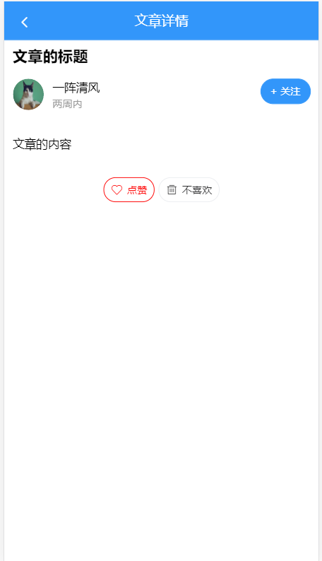

## 文章详情-基础布局

>接下来 我们开始做文章详情的布局,很简单,直接可以将内容和样式 拷贝到页面中

- 内容基础布局

```html
  <div class='container'>
    <van-nav-bar fixed title="文章详情" left-arrow @click-left="$router.back()" />
    <div class="detail">
      <h3 class="title">文章的标题</h3>
      <div class="author">
        <van-image round width="1rem" height="1rem" fit="fill" src="https://img.yzcdn.cn/vant/cat.jpeg" />
        <div class="text">
          <p class="name">一阵清风</p>
          <p class="time">两周内</p>
        </div>
        <van-button round size="small" type="info">+ 关注</van-button>
      </div>
      <div class="content">
        <p>文章的内容</p>
      </div>
      <div class="zan">
        <van-button round size="small" class="active" plain icon="like-o">点赞</van-button>
        &nbsp;&nbsp;&nbsp;&nbsp;
        <van-button round size="small" plain icon="delete">不喜欢</van-button>
      </div>
    </div>
  </div>
```

```less
.container {
  height: 100%;
  overflow-y: auto;
  box-sizing: border-box;
}
.detail {
  padding: 46px 10px 44px;
  .title {
    font-size: 18px;
    line-height: 2;
  }
  .zan{
    text-align: center;
    padding: 10px 0;
    .active{
      border-color:red;
      color: red;
    }
  }
  .author {
    padding: 10px 0;
    display: flex;
    position:sticky;
    background-color: #fff;
    top:46px;
    .text {
      flex: 1;
      padding-left: 10px;
      line-height: 1.5;
      .name {
        font-size: 14px;
        margin: 0;
      }
      .time {
        margin: 0;
        font-size: 12px;
        color: #999;
      }
    }
  }
  .content {
    padding: 20px 0;
    overflow: hidden;
    white-space: pre-wrap;
    word-break: break-all;
    /deep/ img{
      max-width:100%;
      background: #f9f9f9;
    }
    /deep/ code{
      white-space: pre-wrap;
    }                  
  }
}
```

>我们实现了如下的效果



## 文章详情-内容渲染

>OK,接下来我们做获取文章的内容,但是 获取文章内容肯定要有id, 怎么做呢?
>
>文章的id 应该是通过 跳转文章详情 获取的, 那么哪个页面需要跳转到文章详情呢?
>
>分别是 首页  点击文章时 => 跳转到文章详情  => 携带文章id
>
>搜索文章      点击文章时  => 跳转到文章详情  => 携带文章id

>OK, 接下来 我们要在点击文章跳转时,跳转到 文章详情, 我们注意到,我们列表中用到了van-cell组件, 这个组件
>
>有个to属性, 同router-link中的to属性

* 跳转到详情的代码

```html
<van-cell :to="`/article?articleId=${article.art_id.toString()}`" v-for="article in articles" :key="article.art_id.toString()">

```

>值得注意的是, 这样写完之后,我之前在首页做了点击叉号弹出反馈组件的功能突然没有了,那是因为 我们点击叉号事件继续冒泡, 结果触发了跳转, 所以我们需要一个修饰符,让事件停止冒泡

```html
<span class="close" v-if="user.token" @click.stop="$emit('showMoreAction',article.art_id.toString())">
       <van-icon name="cross"></van-icon>
 </span>
```

> OK,我们可以去封装 获取文章详情的API了


* 埋点是什么?

>你做了一个网站,让用户访问,做调研,网站的使用分析
>
>电商网站  => 美妆/电子/家具/洁卫 => 捕获用户点击最多的分类 => 分析用户购买行为
>
>每点一个分类  => 就要记录一下  => 埋点  => 表示在每一次用户行为下面,记录用户行为
>
>埋点 =>  点击行为 / 浏览行为 / 购买行为
>
>埋点  => 友盟 /其他品牌
>
>利益最大化

```js
/***
 *
 *获取文章详情
 * *****/
export function getArticleInfo (id) {
  return request({
    url: `/articles/${id}`
  })
}
```

>然后,我们应该定义数据来接收文章详情的数据

```js
 article: {}, // 接收文章数据
```

>接下来,在methods定义一个方法来查询数据,并在created中完成调用

```js
  methods: {
    // 获取文章详情
    async getArticleInfo () {
      let { articleId } = this.$route.query // 结构查询id
      this.article = await getArticleInfo(articleId) // 查询数据
    }
  },
  created () {
    // 获取文章向详情数据
    this.getArticleInfo()
  }
```

> 接下来 ,我们对页面的静态内容换成动态内容


```html
<template>
 <div class='container'>
    <van-nav-bar fixed :title="article.title" left-arrow @click-left="$router.back()" />
    <div class="detail">
      <h3 class="title">{{ article.title }}</h3>
      <div class="author">
        <van-image round width="1rem" height="1rem" fit="fill"
         :src="article.aut_photo" />
        <div class="text">
          <p class="name">{{ article.aut_name }}</p>
          <!-- relTime过滤器 将时间转化成相对时间 -->
          <p class="time">{{ article.pubdate | relTime }}</p>
        </div>
        <!-- is_followed 为true表示已关注该用户 false表示未关注 -->
        <van-button round size="small" type="info">{{ article.is_followed ? '已关注' : '+ 关注' }}</van-button>
      </div>
      <!-- v-html 可以渲染html标签 -->
      <div class="content" v-html="article.content">
      </div>
      <div class="zan">
       <!-- :class="{css名称: 布尔值}" -->
        <van-button round size="small" :class="{active: article.attitude === 1}" plain icon="like-o">点赞</van-button>
        &nbsp;&nbsp;&nbsp;&nbsp;
        <van-button round size="small" :class="{active: article.attitude === 0}" plain icon="delete">不喜欢</van-button>
      </div>
    </div>
  </div>
</template>
```


## 文章详情-关注与取消关注

> 首先给关注按钮 绑定一个事件 

- 绑定事件

```html
<van-button @click="follow()" round size="small" type="info">
  {{article.is_followed?'已关注':'+ 关注'}}
</van-button>
```

- 封装Api `src/api/user.js`

```js
/** *关注用户***/
export function followUser (data) {
  return request({
    url: '/user/followings',
    method: 'post',
    data
  })
}
/** *取消关注***/
export function unFollowUser (target) {
  return request({
    method: 'delete',
    url: `/user/followings/${target}`
  })
}

```

>OK,现在可以去完成关注和取消关注的业务了
>
>在文章详情中,引入 关注和取消关注方法

```js
import { followUser, unFollowUser } from '@/api/user'

```

```js
    async follow () {
      try {
        if (this.article.is_followed) {
        // 取消关注接口
          await unFollowUser(this.article.aut_id)
        } else {
        // 关注接口
          await followUser({ target: this.article.aut_id })
        }
        this.article.is_followed = !this.article.is_followed
        this.$gnotify({ type: 'success', message: '操作成功' })
      } catch (error) {
        this.$gnotify({ type: 'danger', message: '操作失败' })
      }
    }
```

* 上面的代码中我们在成功之后,将数据状态直接切换了,并没有从后端直接获取

>有个地方值得我们注意,就是原来我们获取的是当前路由的path,并不包含路径中的参数,所以我们换成了fullpath, 这样就可以获取所有的参数

## 文章详情-评论组件-评论列表布局

>OK,又到了比较难的地方了,我们要开始做评论列表了
>
>首先我们要做评论列表的布局,还有底部的评论输入框

我们在article/components下新建一个comment组件结构如下

结构：

```vue
<template>
  <div class="comment">
    <van-list v-model="loading" :finished="finished" finished-text="没有更多了">
      <div class="item van-hairline--bottom van-hairline--top" v-for="index in 5" :key="index">
        <van-image
          round
          width="1rem"
          height="1rem"
          fit="fill"
          src="https://img.yzcdn.cn/vant/cat.jpeg"
        />
        <div class="info">
          <p>
            <span class="name">一阵清风</span>
            <span style="float:right">
              <span class="van-icon van-icon-good-job-o zan"></span>
              <span class="count">10</span>
            </span>
          </p>
          <p>评论的内容，。。。。</p>
          <p>
            <span class="time">两天内</span>&nbsp;
            <van-tag plain @click="showReply=true">4 回复</van-tag>
          </p>
        </div>
      </div>
    </van-list>
    <div class="reply-container van-hairline--top">
      <van-field v-model="value" placeholder="写评论...">
        <van-loading v-if="submiting" slot="button" type="spinner" size="16px"></van-loading>
        <span class="submit" v-else slot="button">提交</span>
      </van-field>
    </div>
  </div>

  <!-- 都不输入框 -->
</template>

<script>
export default {
  data () {                                  
    return {
      // 上拉加载中
      loading: false,
      // 全部加载完毕
      finished: false,
      // 输入的内容
      value: '',
      // 控制提交中状态数据
      submiting: false
    }
  }
}
</script>

<style lang='less' scoped>
.comment {
  margin-top: 10px;
  /deep/ .item {
    display: flex;
    padding: 10px 0;
    .info {
      flex: 1;
      padding-left: 10px;
      .name{
        color:#069;
      }
      .zan{
        vertical-align:middle;
        padding-right:2px;
      }
      .count{
        vertical-align:middle;
        font-size:10px;
        color: #666;
      }
      .time{
        color: #666;
      }
      p {
        padding: 5px 0;
        margin: 0;
      }
    }
  }
  /deep/ .van-button:active::before {
    background: transparent;
  }
}
.reply-container {
  position: fixed;
  left: 0;
  bottom: 0;
  height: 44px;
  width: 100%;
  background: #f5f5f5;
  z-index: 9999;
  .submit {
    font-size: 12px;
    color: #3296fa;
  }
}
</style>

```

> 说一下 定义的四个数据的意义

```js
   // 上拉加载中
      loading: false,
      // 全部加载完毕
      finished: false,
      // 输入的内容
      value: '',
      // 控制提交中状态数据
      submiting: false
```

>loading  和 finished 用来控制列表中的加载状态和加载完成
>
>value  用来读取输入的评论内容
>
>submiting  用来控制提交中状态数据

接下来我们应该在我们的文章详情中引入我们的组件,注册 并且放置在文章内容下面


## 文章详情-评论组件-评论列表渲染

>要做评论列表数据,先用分析接口

| type   | 是   | a或c | 评论类型，a-对文章(article)的评论，c-对评论(comment)的回复   |
| ------ | ---- | ---- | ------------------------------------------------------------ |
| source | 是   |      | 源id，文章id或评论id                                         |
| offset | 否   |      | 获取评论数据的偏移量，值为评论id，表示从此id的数据向后取，不传表示从第一页开始读取数据 |

>通过这个接口参数我们发现, 获取评论 需要 三个参数 
>
>type  表示 获取 **`a文章的评论`**  还是 **`c评论的评论`**
>
>source 表示 获取**`a文章的id`**还是 **`c评论的id`**
>
>offset  **`分页依据`**, 要获取下一页的数据 要传上一页的最后一个id 
>
>不可能一口气把所有的评论全都查询出来, 需要做分页处理, offset, 如果不传或者为null的话,表示查询第一页的数据,  第二页数据 需要 传入 第一页返回的最后一个id, 第三页 需要传入第二页的最后一个id
>
>什么时候结束?
>
>当前页最后一个id 和 整个评论最后一个id相等的时候,表示 结束了  5   5
>
>last_id 表示 当前页的最后一个id
>
>end_id 表示 整个评论 的最后一个id
>
>如果last_id 等于 end_id 表示  我们已经把所有数据请求完毕 => 结束
>
>分页请求 =>  页码 / 每页条数
>
>分页请求 =>  时间戳
>
>分页请求 =>  偏移量
>
>

封装API `src/api/article.js`

```js
/***
 *获取评论或者获取评论回复
 * ***/
export function getComments (params) {
  return request({
    url: '/comments', // 请求地址
    // query参数 放置在params
    // body参数放置在 data
    params
  })
}

```

>给评论列表配置加载状态和配置加载评论的方法
>
>这里目的是: 用户进入文章详情就加载 评论数据

```html
<van-list v-model="loading" :finished="finished" @load="onLoad" finished-text="没有更多了">

```

>实现方法之前,需要设置两个属性, 一个属性用来存放 评论数据, 一个属性用来存放 offset

```js
      comments: [], // 用来存放评论列表的数据
      offset: null // 表示分页依据 如果为空,表示从第一页开始
```

>实现onLoad方法 

```js
    // 一级评论
    async  onLoad () {
      //  加载评论数据
      let data = await getComments({
        type: 'a', // 获取类型
        offset: this.offset, // 偏移量
        source: this.$route.query.articleId // 获取文章的id
      })
      this.comments.push(...data.results) // 将数据添加到当前评论列表的尾部
      this.loading = false // 关闭正在上拉加载的状态
      this.finished = data.last_id === data.end_id // 如果当前页ID等于整个评论最后一个id 表示 我们已经请求万了所有的数据
      if (!this.finished) {
        // 表示 last_id 和 end_id不等 不等的话表示 还有下一页数据
        this.offset = data.last_id // 将last_Id设置成下一页的请求依据
      }
    }
```

渲染结构

```html
     <!-- 评论列表组件 -->
  <div class="comment">
    <!-- 列表  上拉加载  loading  是否开启加载状态 finished 是否已经全部加载完成 -->
    <!-- van-list 组件可以完成上拉加载工作 -->
    <!-- 首页中 我们给van-list组件绑定了 @load事件 -->
    <van-list @load="onLoad" v-model="loading" :finished="finished" finished-text="没有更多了">
      <div class="item van-hairline--bottom van-hairline--top" v-for="comment in comments" :key="comment.com_id.toString()">
        <van-image
          round
          width="1rem"
          height="1rem"
          fit="fill"
          :src="comment.aut_photo"
        />
        <div class="info">
          <p>
            <span class="name">{{ comment.aut_name }}</span>
            <span style="float:right">
              <span class="van-icon van-icon-good-job-o zan"></span>
              <span class="count">{{ comment.like_count }}</span>
            </span>
          </p>
          <p>{{ comment.content }}</p>
          <p>
            <span class="time">{{ comment.pubdate | relTime }}</span>&nbsp;
            <van-tag plain @click="showReply=true">{{ comment.reply_count }} 回复</van-tag>
          </p>
        </div>
      </div>
    </van-list>
    <div class="reply-container van-hairline--top">
      <van-field v-model="value" placeholder="写评论...">
        <van-loading v-if="submiting" slot="button" type="spinner" size="16px"></van-loading>
        <span class="submit" v-else slot="button">提交</span>
      </van-field>
    </div>
  </div>
```


## 文章详情-评论组件-回复列表布局

- 回复列表基础布局

结构：

```html
    <!-- 回复 -->
    <van-action-sheet v-model="showReply" :round="false" class="reply_dialog" title="回复评论">
      <van-list v-model="reply.loading" :finished="reply.finished" finished-text="没有更多了">
        <div class="item van-hairline--bottom van-hairline--top" v-for="index in 8" :key="index">
          <van-image round width="1rem" height="1rem" fit="fill" src="https://img.yzcdn.cn/vant/cat.jpeg" />
          <div class="info">
            <p><span class="name">一阵清风</span></p>
            <p>评论的内容，。。。。</p>
            <p><span class="time">两天内</span></p>
          </div>
        </div>
      </van-list>
    </van-action-sheet>
```

数据：

```js
      // ------------ 回复相关数据 -------------
      // 控制回复弹窗显示隐藏
      showReply: false, // 控制回复列表组件的显示和隐藏
      reply: {
        // 专门用reply这个对象存放回复相关的数据
        loading: false, // 是回复列表组件的状态
        finished: false, // 是回复列表组件的结束状态
        offset: null, // 偏移量 获取评论的评论的分页依据 c
        list: [] // 用于存放 当前弹出的关于某个评论的回复列表的数据
      }
```

样式：

```less
.reply_dialog {
  height: 100%;
  max-height: 100%;
  display: flex;
  overflow: hidden;
  flex-direction: column;
  .van-action-sheet__header {
    background: #3296fa;
    color: #fff;
    .van-icon-close {
      color: #fff;
    }
  }
  .van-action-sheet__content{
    flex: 1;
    overflow-y: auto;
    padding: 0 10px 44px;
  }
}
```

绑定展示回复列表事件

```html
<van-tag plain @click="openReply()">{{comment.reply_count}} 回复</van-tag>
```

```js
    // 打开回复
    openReply () {
      this.showReply = true
    },
```

**`注意`**: 由于我们目前还没有做黑马头条的**`评论功能`**, 所以没办法评论,没有评论数据就没有办法获取回复列表

所以在这里提供一个可以获取 到评论的文章Id, 我们可以先针对这个文章Id  [125051]()  进行测试

## 文章详情-评论组件-回复列表渲染

- 使用获取评论的API，参数改成 **`c`** 即可。c代表获取评论的评论
- 点击的时候，获取当前点击的评论ID,因为只有拿到评论ID,我们才知道获取谁的评论

绑定点击事件获取评论ID：

```html
reply: {
   commentId: null // 用来存放 当前点击的评论Id
```

```html
 <van-tag plain @click="openReply(comment.com_id)">{{comment.reply_count}} 回复</van-tag>
```

**`关闭`**van-list**`主动上拉加载`**,因为我们希望当我们回复的时候,获取第一次,而不是页面加载的时候获取

```html
<van-list @load="getReply" :immediate-check="false" v-model="reply.loading" :finished="reply.finished" finished-text="没有更多了">

```

当打开对话框的时候，获取ID，进行加载, 需要**`重置数据`**

```js

    // 打开回复列表面板
    openReply (commentId) {
      this.showReply = true // 弹出面板
      // 进行若干操作
      this.reply.commentId = commentId // 存储当前点击的commentId
      this.reply.list = [] // 清空原有的数据
      this.reply.offset = null // 重置回复的偏移量 因为每个评论的评论都是从第一页开始
      this.reply.finished = false // 设置成原始状态
      this.reply.loading = true // 主动打开加载状态 因为这个时候没有了自动的检查
      // 开始加载第一页的数据了
      this.getReply() // 开始调用第一页的数据
    },
```

```js
    // 获取评论的评论 也就是获取回复数据的方法
    async getReply () {
      // 加载逻辑
      let data = await getComments({
        type: 'c', // c代表获取评论的评论
        offset: this.reply.offset, // 偏移量
        source: this.reply.commentId.toString() // 代表获取的评论(id)的评论
      })
      // 拿到的data只是请求的第一页的数据
      this.reply.loading = false // 评论的评论的加载状态关闭
      this.reply.finished = data.end_id === data.last_id // 如果last_id 等于end_id表示 没有数据可以再加载了
      if (!this.reply.finished) {
        //  意味着有下一页的数据
        this.reply.offset = data.last_id // 把当前页的最后一个id给偏移量 作为请求下一页的参数依据
      }
    },
```

渲染组件：

```html
 <van-action-sheet :round="false" v-model="showReply"  class="reply_dialog" title="回复评论">
      <!-- 回复列表组件  加载状态 finished finshed-text=""-->
      <!-- immediate-check 控制当前 van-list组件是否主动检查滚动  关闭了主动检查 第一次不会主动的去调用load事件对应的方法了 -->
      <van-list @load="getReply" :immediate-check="false" v-model="reply.loading" :finished="reply.finished" finished-text="没有更多了">
        <!-- 要循环的数据 -->
         <div class="item van-hairline--bottom van-hairline--top" v-for="reply in  reply.list" :key="reply.com_id.toString()">
          <!-- 用户头像 -->
          <van-image round width="1rem" height="1rem" fit="fill" :src="reply.aut_photo" />
          <div class="info">
            <!-- 用户昵称 -->
            <p><span class="name">{{ reply.aut_name }}</span></p>
            <!-- 评论内容 -->
            <p>{{ reply.content }}</p>
             <!--用过滤器 处理相对时间 -->
            <p><span class="time">{{ reply.pubdate | relTime }}</span></p>
          </div>
        </div>
      </van-list>
    </van-action-sheet>
```


## 文章详情-评论组件-评论与回复

- 封装API  `src/api/article.js`

```js
/*****
 *
 * 封装评论或者回复评论的方法
 * ****/
export function commentOrReply (data) {
  return request({
    url: '/comments', // 请求地址
    method: 'post', // 请求类型不同
    data
  })
}
```

- 需要判断是评论，还是回复。根据`reply.commentId`是否有值来判断。(因为评论和回复用了同一个输入框)

```html
<van-action-sheet @closed="reply.commentId=null" 
```

- 绑定事件

```html
<span class="submit" @click="submit()" v-else slot="button">提交</span>
```

```js
     // 提交评论的方法
    async submit () {
      if (!this.value) return false // 表示如果当前评论内容为空就立刻返回
      this.submiting = true // 将提交状态设置成true 控制用户单位时间内评论的数据次数
      await this.$sleep() // 强制等待500 毫秒
      try {
      // 评论
      // 一种是对文章进行评论
      // 一种是对评论进行评论
        // 如果不为空 继续
        // 怎么样区分当前是对文章进行评论 还是对评论进行评论
        // 两种方式 一种方式 通过 showReply的true/false
        // 一种方式 通过 reply.commentId是存在
        const data = await commentOrReply({
        // this.reply.commentId 存在 就要对 评论进行评论  否则传文章ID
          target: this.reply.commentId ? this.reply.commentId.toString() : this.$route.query.articleId, // 要么是文章id, 要么是 评论id
          content: this.value, // 评论的内容
          art_id: this.reply.commentId ? this.$route.query.articleId : null
        // 如果此时对文章进行评论 art_id不能传 如果是对 评论进行评论 文章ID必须传
        })
        // 评论成功怎么处理 刷新页面 => 将评论的数据呈现到 视图上
        // 需要知道加个哪个数组的最前面
        if (this.reply.commentId) {
          // 对评论进行评论
          this.reply.list.unshift(data.new_obj) // 将数据加到 队首 评论的评论
          // 如果对评论的进行评论之后, 应该找到该评论 并将 该评论的回复次数 +1
          // 怎么找到 对应的评论
          // 如果找到了 comment就是找到的对象 如果找不到 comment就是一个undefined
          const comment = this.comments.find(item => item.com_id.toString() === this.reply.commentId.toString())
          comment && comment.reply_count++ // 如果找到了 就对回复数据加1
        } else {
          // 对文章进行评论
          this.comments.unshift(data.new_obj) // 文章评论
        }
        this.value = '' // 清空输入框
      } catch (error) {
        this.$gnotify({ type: 'danger', message: '评论失败' })
      }
      // 最后去关闭 状态
      this.submiting = false // 关闭进度条
    },
```

数据：

```js
  showReply: false, // 控制回复列表组件的显示和隐藏
      reply: {
        // 专门用reply这个对象存放回复相关的数据
        loading: false, // 是回复列表组件的状态
        finished: false, // 是回复列表组件的结束状态
        offset: null, // 偏移量 获取评论的评论的分页依据 c
        list: [], // 用于存放 当前弹出的关于某个评论的回复列表的数据
        commentId: null // 用来存放 当前点击的评论Id
      }
```

值得注意的是: 我们在开发过程中,发现未登录情况下 评论会自动跳到 登录页,但是从登录登录成功后 ,回到文章列表 出现了问题 ,我们**`丢失了文章ID`**, 这是因为我们传递地址的时候 给了一个 **`path`**,我们应该给一个完整地址 **`fullPath`**