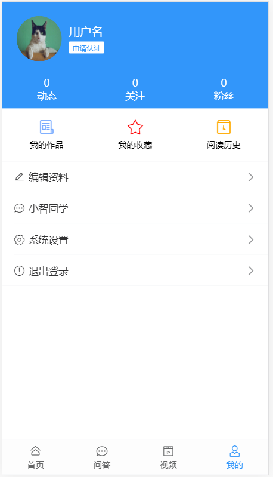

## 个人中心-首页-基础布局

> 为了有一些成就感,我们尝试做一下个人中心的页面,让页面有一些生动的数据

页面结构：

```html
    <div class="user-profile">
      <div class="info">
        <van-image round src="https://img.yzcdn.cn/vant/cat.jpeg" />
        <h3 class="name">
          用户名
          <br />
          <van-tag size="mini">申请认证</van-tag>
        </h3>
      </div>
      <van-row>
        <van-col span="8">
          <p>0</p>
          <p>动态</p>
        </van-col>
        <van-col span="8">
          <p>0</p>
          <p>关注</p>
        </van-col>
        <van-col span="8">
          <p>0</p>
          <p>粉丝</p>
        </van-col>
      </van-row>
    </div>
    <van-row class="user-links">
      <van-col span="8">
        <van-icon name="newspaper-o" color="#7af"/>我的作品
      </van-col>
      <van-col span="8">
        <van-icon name="star-o" color="#f00"/>我的收藏
      </van-col>
      <van-col span="8">
        <van-icon name="tosend" color="#fa0"/>阅读历史
      </van-col>
    </van-row>

    <van-cell-group class="user-group">
      <van-cell icon="edit" title="编辑资料" to="/user/profile" is-link />
      <van-cell icon="chat-o" title="小智同学" to="/user/chat" is-link />
      <van-cell icon="setting-o" title="系统设置" is-link />
      <van-cell icon="warning-o" title="退出登录" to="/login" is-link />
    </van-cell-group>
```

样式：

```less
.user {
  &-profile {
    width: 100%;
    height: 150px;
    display: block;
    background: #3296fa;
    color: #fff;
    .info {
      display: flex;
      padding: 20px;
      align-items: center;
      .van-image{
        width: 64px;
        height: 64px;
      }
      .name {
        font-size: 16px;
        font-weight: normal;
        margin-left: 10px;
      }
      .van-tag {
        background: #fff;
        color: #3296fa;
      }
    }
    p{
      margin: 0;
      text-align: center;
    }
  }
  &-group {
    margin-bottom: 15px;
  }
  &-links {
    padding: 15px 0;
    font-size: 12px;
    text-align: center;
    background-color: #fff;
    .van-icon {
      display: block;
      font-size: 24px;
      padding-bottom: 5px;
    }
  }
}
```




## 个人中心-首页-渲染

> OK,基本页面有了, 我们再继续尝试 进行一下个人中心数据的加载

定义API `src/api/user.js`

```js
/** **获取用户个人信息*****/
export function getUserInfo () {
  return request({
    url: '/user'
  })
}
```

获取个人信息

```js
import { getUserInfo } from '@/api/user'
export default {
  name: 'user',
  data () {
    return {
      userInfo: {}
    }
  },
  methods: {
    async getUserInfo () {
      this.userInfo = await getUserInfo()
    }
  },
  created () {
    this.getUserInfo()
  }
}
```

渲染组件：

```html
    <div class="user-profile">
      <div class="info">
        <van-image round :src="user.photo" />
        <h3 class="name">
          {{user.name}}
          <br />
          <van-tag size="mini">申请认证</van-tag>
        </h3>
      </div>
      <van-row>
        <van-col span="6">
          <p>{{user.art_count}}</p>
          <p>动态</p>
        </van-col>
        <van-col span="6">
          <p>{{user.follow_count}}</p>
          <p>关注</p>
        </van-col>
        <van-col span="6">
          <p>{{user.fans_count}}</p>
          <p>粉丝</p>
        </van-col>
        <van-col span="6">
          <p>{{user.like_count}}</p>
          <p>被赞</p>
        </van-col>
      </van-row>
```


## 个人中心-首页-退出登录

>OK,我们做一下,首页的退出登录,年前的任务就愉快的结束了.
>
>退出登录并不只是单纯的跳到登录页,我们应该在退出之前清除token, 这里还要用到 我们的vuex

>首先,我们需要将原来的用户token删除, 然后在跳到登录页面 
>
>给点击退出登录注册一个事件

```html
 <van-cell icon="warning-o" title="退出登录" @click="lgout" is-link />
```

> 引入 mutations方法 ,调用删除用户操作

```js
  computed: {
    ...mapMutations(['delUser'])
  },
```

>OK,接下来,在登录的方法中,先友好的提示下,然后进行相应的操作吧

```js
       // 登出方法
    async lgout () {
      try {
        await this.$dialog.confirm({
          title: '提示',
          message: '确定要退出登录吗'
        })
        this.clearUser()
        this.$router.push('/login')
      } catch (error) {

      }
    }
```


## 个人中心-编辑资料-基础布局

静态结构：

```html
  <div class="container">
    <van-nav-bar left-arrow @click-left="$router.back()" title="编辑资料" right-text="保存" ></van-nav-bar>
    <van-cell-group>
      <van-cell is-link title="头像"  center>
        <van-image
          slot="default"
          width="1.5rem"
          height="1.5rem"
          fit="cover"
          round
          src="https://img.yzcdn.cn/vant/cat.jpeg"
        />
      </van-cell>
      <van-cell is-link title="名称" value="用户名称" />
      <van-cell is-link title="性别" value='男'/>
      <van-cell is-link title="生日" value="2019-08-08" />
    </van-cell-group>
  </div>
```

>  头像弹层

```html
 <!-- 弹层组件 -->
    <van-popup v-model="showPhoto" style="width:80%">
      <!-- 内容 -->
      <!-- 1 本地相册选择图片 -->
      <!-- 2 拍照 -->
       <van-cell is-link title="本地相册选择图片"></van-cell>
       <van-cell is-link title="拍照"></van-cell>
    </van-popup>
```

>昵称弹层

```html
  <!-- 弹昵称 -->
    <van-popup v-model="showName" style="width:80%">
       <!-- 编辑用户昵称  双向绑定用户的昵称-->
       <van-field v-model="user.name" type='textarea'  rows="4"></van-field>
    </van-popup>
```

> 性别弹层 =>van-action-sheet

```html
<van-action-sheet :actions="actions" v-model="showGender" cancel-text="取消"></van-action-sheet>

```

>生日弹层

```html
<van-popup v-model="showBirthDay" position="bottom">
      <!-- 选择出生日期  出生日期应该小于现在时间-->
      <!-- type表示 当前的日期类型 年月日 -->
      <van-datetime-picker
           v-model="currentDate"
           type="date"
          :min-date="minDate"
          :max-date="maxDate"
         />
    </van-popup>
```

>定义四个变量控制 四个弹层的显示隐藏

```js
      showBirthDay: false, // 是否显示日期弹层
      showPhoto: false, // 是否显示选择头像弹层
      showName: false, // 是否显示编辑昵称的弹层
      showGender: false, // 是否显示性别选择的弹层
```

>定义 性别的数据 ,定义最大时间最小时间

```js
      actions: [{ name: '男' }, { name: '女' }] // 性别数据
      minDate: new Date(1900, 1, 1), // 最小时间
      maxDate: new Date(), // 生日最大时间 永远是小于等于当前时间的
      currentDate: new Date(), // 当前时间
```

>接下来需要对 四个弹层的内容进行设置

>首先 对昵称进行控制,控制昵称的长度 1-7,所以 先把popup组件的点击 背景关闭 给禁用掉

```vue
:close-on-click-overlay="false"  // 点击背景关闭弹窗 功能被禁用掉
```

>放置一个按钮来控制 弹层的关闭,给按钮注册一个事件,事件中对 长度进行判断

```js
    // 绑定按钮点击事件
    btnName () {
      if (this.user.name.length < 1 || this.user.name.length > 7) {
        //  如果长度 小于1 或者大于7 表示 这个昵称不符合要求
        this.nameMsg = '您的用户昵称不符合1-7的长度要求'
        return false // 不会继续往下执行了
      }
      // 如果满足的话 就会继续执行
      this.nameMsg = '' // 先把提示消息清空
      this.showName = false // 关闭弹层
    }
```

>最终昵称弹层结构为

```vue
 <!-- 弹昵称  关闭点击弹层 关闭功能-->
    <van-popup :close-on-click-overlay="false" v-model="showName" style="width:80%">
       <!-- 编辑用户昵称  双向绑定用户的昵称-->
       <van-field :error-message="nameMsg" v-model.trim="user.name" type='textarea'  rows="4"></van-field>
       <!-- 关闭按钮组件 -->
       <van-button type="info"  size="large" block  @click="btnName">确定</van-button>
    </van-popup>
```

>继续性别弹层, 捕获**`点击上拉菜单选项的事件`**, select事件,在select事件中,根据选择的选项进行判断

```js
    // 当点击菜单项时 会触发该方法
    selectItem (item) {
      // item就是选择的对象
      this.user.gender = item.name === '男' ? 0 : 1 // 根据判断得到当前的性别
      this.showGender = false // 关闭当前的弹层
    }
```

>性别弹层的结构代码

```vue
<van-action-sheet @select="selectItem" :actions="actions" v-model="showGender" cancel-text="取消"></van-action-sheet>
```

>对弹出生日弹层时,进行一下处理, 点击弹出时, 将当前用户的生日 设置给 datetime-picker组件

```js
  // 点击 生日弹层的确定时  触发的方法
    confirmDate (date) {
      this.user.birthday = dayjs(date).format('YYYY-MM-DD') // 将转化后的结果赋值给 user中的生日
      this.showBirthDay = false // 关闭弹层
    },
          // 点击生日时  触发
    showDate () {
      // 要将字符串  2019-08-08 转化成日期类型
      this.currentDate = new Date(this.user.birthday) // 将当前用户的生日 赋值给绑定当前时间的数据
      this.showBirthDay = true // 显示生日弹层
    },
```

>生日弹层结构

```vue
 <!-- 生日弹层 -->
    <van-popup v-model="showBirthDay" position="bottom">
      <!-- 选择出生日期  出生日期应该小于现在时间-->
      <!-- type表示 当前的日期类型 年月日 -->
      <!-- v-model表示当前的时间   取消时 将弹层关闭-->
      <van-datetime-picker
           v-model="currentDate"
           type="date"
          :min-date="minDate"
          :max-date="maxDate"
          @cancel="showBirthDay=false"
          @confirm="confirmDate"
         />
    </van-popup>
```

>封装 API的方法 

```js
/****
 * 获取用户个人资料
 * *****/
export function getUserProfile () {
  return request({
    url: '/user/profile' // 获取用户个人资料的接口地址
  })
}
```

>封装一个获取数据设置数据的方法

```js
  // 获取用户资料的方法
    async  getUserProfile () {
      let data = await getUserProfile()
      // 将数据赋值给user
      this.user = data
    }
```

>在钩子函数中调用

```js
  created () {
    this.getUserProfile() // 调用获取用户资料的方法
  }
```

OK,搞定了 下面是完整的代码

完整的结构：

```html
<template>
   <div class="container">
     <!-- 导航 -->
    <van-nav-bar left-arrow @click-left="$router.back()" title="编辑资料" right-text="保存" ></van-nav-bar>
    <van-cell-group>
      <!-- 头像 -->
      <van-cell is-link title="头像"  center>
        <!-- 头像 -->
        <!-- 点击图片 显示选择图片的弹层 -->
        <van-image
          slot="default"
          width="1.5rem"
          height="1.5rem"
          fit="cover"
          round
          @click="showPhoto=true"
          :src="user.photo"
        />
      </van-cell>
      <!-- 用户昵称 -->
      <van-cell is-link title="名称" @click="showName=true" :value="user.name" />
      <!-- 性别 -->
      <van-cell is-link title="性别" @click="showGender=true" :value='user.gender === 0 ? "男" : "女"'/>
      <!-- 生日 -->
      <van-cell is-link title="生日" @click="showDate" :value="user.birthday" />
    </van-cell-group>
    <!-- 弹层组件 -->
    <van-popup v-model="showPhoto" style="width:80%">
      <!-- 内容 -->
      <!-- 1 本地相册选择图片 -->
      <!-- 2 拍照 -->
       <van-cell is-link title="本地相册选择图片"></van-cell>
       <van-cell is-link title="拍照"></van-cell>
    </van-popup>
    <!-- 弹昵称  关闭点击弹层 关闭功能 round  和 :rou="true" 效果是一样的-->
    <van-popup round :close-on-click-overlay="false" v-model="showName" style="width:80%">
       <!-- 编辑用户昵称  双向绑定用户的昵称-->
       <van-field :error-message="nameMsg" v-model.trim="user.name" type='textarea'  rows="4"></van-field>
       <!-- 关闭按钮组件 -->
       <van-button type="info"  size="large" block  @click="btnName">确定</van-button>
    </van-popup>
    <!-- 性别选择上拉菜单 性别数据通过actions属性来显示 -->
    <van-action-sheet @select="selectItem" :actions="actions" v-model="showGender" cancel-text="取消"></van-action-sheet>
    <!-- 生日弹层 -->
    <van-popup v-model="showBirthDay" position="bottom">
      <!-- 选择出生日期  出生日期应该小于现在时间-->
      <!-- type表示 当前的日期类型 年月日 -->
      <!-- v-model表示当前的时间   取消时 将弹层关闭-->
      <van-datetime-picker
           v-model="currentDate"
           type="date"
          :min-date="minDate"
          :max-date="maxDate"
          @cancel="showBirthDay=false"
          @confirm="confirmDate"
         />
    </van-popup>
  </div>
</template>
```

完整的数据：

```js
  data () {
    return {
      minDate: new Date(1900, 1, 1), // 最小时间
      maxDate: new Date(), // 生日最大时间 永远是小于等于当前时间的
      currentDate: new Date(), // 当前时间

      showBirthDay: false, // 是否显示日期弹层
      showPhoto: false, // 是否显示选择头像弹层
      showName: false, // 是否显示编辑昵称的弹层
      showGender: false, // 是否显示性别选择的弹层
      // 定义数据
      user: {
        name: '', // 用户昵称
        gender: 1, // 0男 1 女
        birthday: '' // 给一个默认生日
      },
      actions: [{ name: '男' }, { name: '女' }], // 性别数据
      nameMsg: '' // 专门来控制显示的错误信息
    }
  },
```

完整的方法

```js
  methods: {
    // 绑定按钮点击事件
    btnName () {
      if (this.user.name.length < 1 || this.user.name.length > 7) {
        //  如果长度 小于1 或者大于7 表示 这个昵称不符合要求
        this.nameMsg = '您的用户昵称不符合1-7的长度要求'
        return false // 不会继续往下执行了
      }
      // 如果满足的话 就会继续执行
      this.nameMsg = '' // 先把提示消息清空
      this.showName = false // 关闭弹层
    },
    // 当点击菜单项时 会触发该方法
    selectItem (item) {
      // item就是选择的对象
      this.user.gender = item.name === '男' ? 0 : 1 // 根据判断得到当前的性别
      this.showGender = false // 关闭当前的弹层
    },
    // 点击生日时  触发
    showDate () {
      // 要将字符串  2019-08-08 转化成日期类型
      this.currentDate = new Date(this.user.birthday) // 将当前用户的生日 赋值给绑定当前时间的数据
      this.showBirthDay = true // 显示生日弹层
    },
    // 点击 生日弹层的确定时  触发的方法
    confirmDate (date) {
      this.user.birthday = dayjs(date).format('YYYY-MM-DD') // 将转化后的结果赋值给 user中的生日
      this.showBirthDay = false // 关闭弹层
    },
    // 获取用户资料的方法
    async  getUserProfile () {
      let data = await getUserProfile()
      // 将数据赋值给user
      this.user = data
    }
  },
```

渲染：

```js
    async getUserProfile () {
      const data = await getUserProfile()
      this.user = data 
      this.photo = data.photo
    }
```

封装API `src/api/user.js`

```js
/****
 * 获取用户个人资料
 * *****/
export function getUserProfile () {
  return request({
    url: '/user/profile' // 获取用户个人资料的接口地址
  })
}
```


## 个人中心-编辑资料-修改头像

- 准备上传文件控件

```html
    <!-- 文件选择控件 -->
    <input ref="file" @change="upload()" type="file" style="display:none">
```

- 点击头像触发控件

```html
  <van-cell @click="openChangeFile" is-link title="本地相册选择图片"></van-cell>
```

>需要在点击事件中, 触发文件上传的点击事件

```js
  // 点击选择图片时触发
    openChangeFile () {
      // 上传本地文件
      // 触发文件上传组件的点击事件
      // 需要先获取文件上传的dom对象再触发
      this.$refs.myFile.click() // 触发文件上传组件的点击方法
    }
```

- 绑定upload函数

```js
  // 当我们选择图片之后就会触发
    async upload () {
      // 这里应该做什么
      // 应该上传头像 获取我们的选择的图片呢
      // 首先 应该把这个图片上传到服务器
      // 调用编辑头像的方法
      let data = new FormData()
      data.append('photo', this.$refs.myFile.files[0]) // 往formData中添加参数
      let result = await updateImg(data)
      // 应该 把地址 同步设置给 当前页面的数据
      this.user.photo = result.photo // 将上传成功的头像设置给当前头像
      this.showPhoto = false // 关闭弹层
    }
```

- 封装API `src/api/user.js`

```js
/****
 *封装一个编辑用户头像的API
 * ****/
export function updateImg (data) {
  return request({
    url: '/user/photo', // 编辑头像的地址
    method: 'patch', // 设置头像的类型
    data
  })
}


```

## 个人中心-编辑资料-修改信息

- 绑定事件

```html
      <van-nav-bar @click-right="saveUser" left-arrow @click-left="$router.back()" title="编辑资料" right-text="保存" ></van-nav-bar>
```

- 实现保存

```js
    // 保存方法  调用保存接口  这里是不需要传photo数据的
    // 1 我们通过别的方法 更新了头像
    // 2 photo base64字符串
    async saveUserInfo () {
      try {
        await saveUserInfo({ ...this.user, photo: null })
        this.$gnotify({ type: 'success', message: '保存成功' })
      } catch (error) {
        this.$gnotify({ type: 'danger', message: '保存失败' })
      }
    }
```

- 封装保存API `src/api/user.js`

```js
/** 封装一个 保存用户的方法***/
export function saveUserInfo (data) {
  return request({
    url: '/user/profile', // 编辑资料的地址
    data,
    method: 'patch'
  })
}

```

## 个人中心-小智同学-基础布局

> 小智同学 是一个可以对话的客服, 可以和她对话,她会回答

git 回退到上一个版本

```bash
$  git  reset --hard HEAD #git回退到上一个版本
```


页面结构：

```html
  <div class="container">
    <van-nav-bar fixed left-arrow @click-left="$router.back()" title="小智同学"></van-nav-bar>
    <div class="chat-list">
      <div class="chat-item left">
        <van-image fit="cover" round src="https://img.yzcdn.cn/vant/cat.jpeg" />
        <div class="chat-pao">ewqewq</div>
      </div>
      <div class="chat-item right">
        <div class="chat-pao">ewqewq</div>
        <van-image  fit="cover" round src="https://img.yzcdn.cn/vant/cat.jpeg" />
      </div>
    </div>
    <div class="reply-container van-hairline--top">
      <van-field v-model="value" placeholder="说点什么...">
        <van-loading v-if="loading" slot="button" type="spinner" size="16px"></van-loading>
        <span v-else @click="send()" slot="button" style="font-size:12px;color:#999">提交</span>
      </van-field>
    </div>
  </div>
```

样式：

lang = 'less'  => 让style支持less

scoped  => 只对自己的组件样式起作用

```less
.container {
  height: 100%;
  width: 100%;
  position: absolute;
  left: 0;
  top: 0;
  box-sizing: border-box;
  background:#fafafa;
  padding: 46px 0 50px 0;
  .chat-list {
    height: 100%;
    overflow-y: scroll;
    .chat-item{
      padding: 10px;
      .van-image{
        vertical-align: top;
        width: 40px;
        height: 40px;
      }
      .chat-pao{
        vertical-align: top;
        display: inline-block;
        min-width: 40px;
        max-width: 70%;
        min-height: 40px;
        line-height: 38px;
        border: 0.5px solid #c2d9ea;
        border-radius: 4px;
        position: relative;
        padding: 0 10px;
        background-color: #e0effb;
        word-break: break-all;
        font-size: 14px;
        color: #333;
        &::before{
          content: "";
          width: 10px;
          height: 10px;
          position: absolute;
          top: 12px;
          border-top:0.5px solid #c2d9ea;
          border-right:0.5px solid #c2d9ea;
          background: #e0effb;
        }
      }
    }
  }
}
.chat-item.right{
  text-align: right;
  .chat-pao{
    margin-left: 0;
    margin-right: 15px;
    &::before{
      right: -6px;
      transform: rotate(45deg);
    }
  }
}
.chat-item.left{
  text-align: left;
  .chat-pao{
    margin-left: 15px;
    margin-right: 0;
    &::before{
      left: -5px;
      transform: rotate(-135deg);
    }
  }
}
.reply-container {
  position: fixed;
  left: 0;
  bottom: 0;
  height: 44px;
  width: 100%;
  background: #f5f5f5;
  z-index: 9999;
}
```

数据：

```js
export default {
  data () {
    return {
      value: '',
      loading: false
    }
  },
  methods: {
    send () {

    }
  }
}
```


## 个人中心-小智同学-认识websocket

> WebSocket 是一种数据通信协议，类似于我们常见的 http 协议。

移动端 /PC端  => http协议 => 只能由客户端发起 =>只有 request(请求)  才会有response(响应)

轮询  => setTimeout  => 定时器  => 每隔一段时间就向 服务器发出请求,服务器给你响应

初次接触 WebSocket 的人，都会问同样的问题：我们已经有了 HTTP 协议，为什么还需要另一个协议？它能带来什么好处？答案很简单，因为 HTTP 协议有一个缺陷：通信**`只能由客户端发起`**。

这种**`单向请求`**的特点，注定了如果服务器有连续的状态变化，客户端要获知就非常麻烦。我们只能使用 "**`轮询`**" 每隔一段时候，就发出一个询问，了解服务器有没有新的信息。最典型的场景就是聊天室。

>轮询方式的聊天室  http(协议)
>
>张三和李四对话  
>
>张三发送一条消息  => 调用后端发送消息的接口 => 将发送的消息存到后台/数据库
>
>李四想要获取消息 => 每隔一段时间 => 调用获取消息的接口 => 检查 服务器是否有自己的消息 => 带回消息 => 更新到页面

轮询的**`效率低`**，非常浪费资源（因为必须不停连接，或者 HTTP 连接始终打开）。因此，工程师们一直在思考，有没有更好的方法。WebSocket 就是这样发明的。WebSocket 协议在2008年诞生，2011年成为国际标准。

它的最大特点就是，服务器可以**`主动向客户端推送信息`**，客户端也可以主动向服务器发送信息，是真正的双向平等对话。


Http => 单向的  => 只能由客户端发起

websocket  => 双向的  => 既可以 客户端 =>服务端   服务端  => 客户端 

网页版微信/ 网页版 qq/ 网页版阿里旺旺 /网页版客服/网页版微博  => web即时通信 =>你发一发消息 别人就能收到  => websocket  => 传输数据  =>  客户 => 服务  服务 => 客户

截图功能  => 客户端本地 进行了一下页面的画图 => 插件

## 个人中心-小智同学-使用websocket

浏览器为 HTTP 通信提供了 XMLHttpRequest 对象，同样的，也为 WebSocket 通信提供了一个操作接口：WebSocket。

通信模型：

- 拨号（建立连接）  =>  建立与服务器(**`连接地址`**)的连接  

- 通话（双向通信） => 连接成功之后 => 通信 => 发送数据  =>   **`服务器`**   => 转发给某个人    接收数据 

  客户端  => 服务端  /  服务端  =>客户端

- 结束通话（关闭连接）

>一旦拨号成功 我们就可以发送消息  客户端  => 服务端发消息
>
>拨号成功之后 会调用  onopen事件
>
>发送消息   ws.send 
>
>接收消息 ws.onmessage 事件  => event  => data => 服务器发过来的消息数据
>
>如果 不需要再对话了 ,  需要调用close 方法 ,关闭成功之后 会调用 onclose方法

体验代码：

```js
<!DOCTYPE html>
<html lang="en">
<head>
    <meta charset="UTF-8">
    <meta name="viewport" content="width=device-width, initial-scale=1.0">
    <title>测试websocket</title>
    <style>
        .main {
            height: 400px;
            border: 2px solid red
        }
    </style>
</head>
<body>
    <div id="main" class='main'>

    </div>
    <input type="text" id="myContent">
    <button onclick="openWs()">打开连接</button>
    <button onclick="sendMessage()">发送消息</button>
    <button onclick="closeWs()">关闭连接</button>
    <script>
        var isOpen = false // 是否打开了连接
        var msgDom = document.getElementById("main") // 获取聊天框的dom元素
        var ws 

var sendMessage = function(){
  var dom = document.getElementById("myContent")
//   只有当消息不为空 并且 已经连接的情况下 才去发送消息
 if(dom.value && isOpen)  {
    //  如果存在 发送消息 给服务器发消息
    ws.send(dom.value)  // 没有任何返回值  客户端  => 服务端 发消息
    msgDom.innerHTML = msgDom.innerHTML + `<div>
       <span>我说:</span>
       ${dom.value}
    </div>`
    // 清空输入框内容的内容
    dom.value = ''
 }
}
//  关闭连接
var closeWs = function (){
    ws.close() // 关闭连接
}
// 打开连接
var  openWs = function () {
// 创建连接  尝试拨号 =>  wss://echo.websocket.org
 ws = new WebSocket("wss://echo.websocket.org"); // 初始化一个websocket对象
 // 连接成功 当拨号成功 会调用 onopen方法
ws.onopen = function(evt) { 
  console.log(" 与服务建立连接成功 ..."); 
  isOpen = true // 建立成功 就将状态设置true 
  // 发消息
//  ws.send("Hello WebSockets!");
};
// 接消息  服务器  => 客户端 发消息
ws.onmessage = function(event) {
  console.log( "服务器过来的消息: " + event.data);
  msgDom.innerHTML = msgDom.innerHTML + `<div>
       <span>服务器说:</span>
       ${event.data}
    </div>`
  // 关闭连接
 // ws.close();
};
// 关闭成功
ws.onclose = function(evt) {
  console.log("连接关闭");
  isOpen = false // 将状态设置为 false
}; 
}
    </script>
</body>
</html>
```


## 个人中心-小智同学-认识socket.io

> 原生的 WebSocket 使用比较麻烦，所以推荐使用一个**`封装好的解决方案`**：socket.io 。

socket.io 提供了**`服务端 + 客户端`**的实现

- 客户端：浏览器
- 服务端：Java、Python、PHP、。。。。Node.js

官网：https://socket.io/

代码：https://github.com/socketio/socket.io


## 个人中心-小智同学-体验socket.io

官网的DEOM：https://socket.io/get-started/chat/

前后一体的项目 => express / socket.io

>初始化一个项目

```bash
$ npm init -y # -y的目的是 快速生成一个package.json 不用频繁回车了
```

> 安装对应的依赖

```bash
$ npm i express socket.io  # 安装对应的两个依赖
```

* 查看 npm 的镜像地址

  ```bash 
  $ npm  config get registry
  ```

  * 设置npm  的镜像地址为 淘宝镜像( 因为 npm的服务器在国外, 淘宝在国内,=> 网速更快,不易出错)

  ```bash
  $ npm config  set registry  https://registry.npm.taobao.org/
  ```


**`服务端代码`**：=> 根目录下 创建 **`app.js`**, 写入下方的代码

```js
var app = require('express')();
var http = require('http').createServer(app);
var io = require('socket.io')(http);

app.get('/', function(req, res){
  res.sendFile(__dirname + '/index.html');
});

io.on('connection', function(socket){

  socket.on('disconnect', function(){
    console.log('user disconnected');
  });

  socket.on('chat message', function(msg){
    io.emit('chat message', msg);
  });
});

http.listen(3000, '0.0.0.0', function(){
  console.log('listening on *:3000');
});
```

**`客户端代码`**：=>根目录 下 创建index.html 

```html
<!doctype html>
<html>
  <head>
    <title>Socket.IO chat</title>
    <meta charset="utf-8" >                  
    <style>
      * { margin: 0; padding: 0; box-sizing: border-box; }
      body { font: 13px Helvetica, Arial; }
      form { background: #000; padding: 3px; position: fixed; bottom: 0; width: 100%; }
      form input { border: 0; padding: 10px; width: 90%; margin-right: .5%; }
      form button { width: 9%; background: rgb(130, 224, 255); border: none; padding: 10px; }
      #messages { list-style-type: none; margin: 0; padding: 0; }
      #messages li { padding: 5px 10px; }
      #messages li:nth-child(odd) { background: #eee; }
    </style>
  </head>
  <body>
    <!-- 消息列表 -->
    <ul id="messages"></ul>

    <!-- 发送消息的表单 -->
    <form action="">
      <input id="m" autocomplete="off" /><button>Send</button>
    </form>

    <!-- SocketIO 提供了一个客户端实现：socket.io.js -->
    <script src="/socket.io/socket.io.js"></script>
    <script src="https://code.jquery.com/jquery-1.11.1.js"></script>
    <script>
      // 建立连接，得到 socket 通信对象
      var socket = io()

      socket.on('connect', () => {
        console.log('建立连接成功了')
      })

      $('form').submit(function(e){
        e.preventDefault();
        socket.emit('chat message', $('#m').val());
        $('#m').val('');
        return false;
      });

      socket.on('chat message', function(msg){
        $('#messages').append($('<li>').text(msg));
      });
    </script>
  </body>
</html>
```

>启动项目 

```bash
$  node app  #启动创建好的项目
```

>调试方式启动

* 直接用vscode来进行调试 => 启动调试, 打断点,在想要监视的位置打断点
* 需要注意的是  => 点击的调试的时候,**`当前打开的文件 必须是nodejs代码文件`** , 否则调试不成功

总结：我们关注的是**`客户端代码`**。

- 安装包  socket.io-client   导入使用 `import io from 'socket.io-client'`
- 建立连接 `const socket = io('地址',{额外传参})`  等同于 原生websocket new WebSocket()

- 发消息：`socket.emit('chat message', '内容');`
- 收消息：`socket.on('chat message', function(msg){}`

## 个人中心-小智同学-实现聊天

>接下来,我们开始做小智同学的客服业务,
>
>首先第一步,我们需要给小智同学一个头像,这个头像可以采用一个我们的静态地址

>在页面中引入 小智头像的地址, 然后给data中的数据赋值

```js
import XZImg from '@/assets/images/xz.png'
```

>给data赋值

```js
 data () {
    return {
      value: '',
      loading: false,
      XZImg
    }
  },
```

> 头像数据替换视图上的头像

```html
<van-image fit="cover" round :src="XZImg" />
```

>然后就是自己的头像了, 自己的头像并不能这样写死了.因为用户的头像是可以自己进行上传编辑的, 这个头像应该是从接口获取的用户资料中的头像,那么 用户资料的头像 怎么获取呢?
>
>重新调用一次用户接口吗 ? 
>
>**`不用`**!!!  还记得吗,我们曾经学过**`状态共享`**的一个框架**`Vuex`**, 可以用这个框架来把我们的**`头像共享`**, 这样在聊天页,就可以轻而易举的获得用户的头像了


>首先,我们需要在state中定义我们的共享数据

`src/store.js`  vuex管理

```js
 state: {
    user: auth.getUser(), // 从缓存中
    photo: null // 用户头像
  },
```

> 然后,我们的vuex更新数据必须通过 **`mutations`**,所以 还需要定义一个mutations来更新photo

```js
  //  更新用户头像的方法 载荷 携带参数用的
    updatePhoto (state, payload) {
      state.photo = payload.photo // 将载荷里面的数据设置给state
    }
```

>OK, 数据和更新数据的方法定义好了,接下来,我们需要在个人资料的页面,进行用户头像的Vuex数据设置
>
>为什么要在个人中心?   因为要进入 小智同学,必须通过 个人中心, 我们可以通过 个人中心的获取个人资料的方法  去更新用户头像

> 那么需要引入 更新头像的mutation来进行设置, 这个时候用到了我们的辅助函数 **`mapMutations`**

*  ```js
  ...mapMutations(['clearUser', 'updatePhoto']),
  ```

>在获取用户资料时 更新头像 

```js
async getUserInfo () {
      this.userInfo = await getUserInfo()
      this.updatePhoto({ photo: this.userInfo.photo }) // 更新用户的头像
},
```

>完事了吗?  没有! 我们还有一个功能, 就是可以编辑用户头像,我们同样需要在编辑用户资料 和 编辑头像成功后 
>
>进行头像的更新

`src/views/user/profile.vue`  编辑资料 获取资料成功后 设置头像信息

```js
    // 获取用户资料的方法
    async  getUserProfile () {
      let data = await getUserProfile()
      // 将头像地址 更新设置给公共的state
      this.updatePhoto({ photo: data.photo }) // 载荷参数
      // 将数据赋值给user
      this.user = data
    },
```

`src/views/user/profile.vue`  编辑头像成功后设置头像信息

```js
// 当我们选择图片之后就会触发
    async upload () {
      // 这里应该做什么
      // 应该上传头像 获取我们的选择的图片呢
      // 首先 应该把这个图片上传到服务器
      // 调用编辑头像的方法
      let data = new FormData()
      data.append('photo', this.$refs.myFile.files[0]) // 往formData中添加参数
      let result = await updateImg(data)
      // 应该 把地址 同步设置给 当前页面的数据
      this.user.photo = result.photo // 将上传成功的头像设置给当前头像
      this.showPhoto = false // 关闭弹层
      //  当头像上传成功之后 把上传成功的头像的地址 设置给state
      this.updatePhoto({
        photo: result.photo
      }) // 调用mutations方法 将数据设置给公共状态
    },
```

>OK了,头像在vuex中设置好了,接下来 我们需要在小智客服里面获取该头像,这个时候用到我们的辅助函数
>
>**`mapState`**

`src/views/user/chat.vue` 使用头像

```js
import { mapState } from 'vuex
```

```js
  computed: {
    ...mapState(['photo']) // 映射vuex中的公共变量
  }
```

```html
<van-image  fit="cover" round :src="photo" />
```

>两个人的头像设置好了, 接下来 做聊天的内容
>
>首先定义一个list来存储 两个人聊天的内容

```js
 // 聊天记录
 list: []
```

>然后我们需要安装进行websocket通讯的包 socket.io

```bash
$ npm i socket.io-client
$ yarn add socket.io-client
```

>要实现和 客服聊天,首先需要建立和服务器的连接
>
>so,第一步,我们需要在初始化的钩子函数中, 进行websocket连接的打开
>
>需要注意的是, 打开websocket连接 同样需要用户的token,这时可以通过vuex来获取数据用户token


```js
  // 实例创建完毕之后执行的函数
  created () {
    // 建立和websocket和服务器的连接
    // 原生方式  new WebSocket()
    // 封装的socket.io
    // io(连接地址, { 额外参数 })
    this.socket = io('http://ttapi.research.itcast.cn', {
      // query参数
      query: {
        token: this.user.token // 从vuex中获取用户的token
      }
    }) // 用this.socket 接收了一个socketIO的实例对象
    this.socket.on('connect', () => {
      console.log('和服务器建立连接成功!!!')
      // 先让小智同学和用户说一句话 模拟说话
      this.list.push({ msg: '秃头小王子,你好,跟我唠唠呗', name: 'xz' }) // name:xz 表示这句话是小智同学说的
    })
    //  如何知道建立连接成功
    // 需要监听 小智同学回复的消息 回到参数中是参数的
    // data =>  msg (小智同学回复的内容)
    // timestmp (小智同学回复的时间戳)
    // 这个位置 只有小智同学回复的时候才会调用
    this.socket.on('message', (data) => {
      this.list.push({ ...data, name: 'xz' }) // name:xz相当于 给我们的消息记录一下 谁发了这个消息
    })
  }
```

>连接建立好了 ,这个时候我们将数据反映到视图上, 小智同学的消息在左边,用户的在右边,所以可以通过
>
>name的值来判断是小智的消息还是自己的  如果是xz就是小智 如果是self就是自己

```html
      <!-- list的数据分两种 一种是小智同学说的 一种是我自己说的 -->
      <!-- 这个div 要展示两种场景 小智的场景 左边  我的场景 右边 -->
      <!-- 根据当前 name的值 决定 样式 是left 还是right  -->
      <!--  v-bind绑定class的对象语法  当前的样式left还是right -->
      <div :class="{ left: item.name === 'xz', right: item.name!='xz' }"  class="chat-item" v-for="(item,index)  in list" :key="index">
        <!-- 小智同学的图片 -->
        <!-- 需要根据item中的name值 决定是否显示 左侧的图片 或者右侧的图片 -->
        <van-image v-if="item.name === 'xz'" fit="cover" round  :src="XZImg" />
        <div class="chat-pao">{{ item.msg }}</div>
        <!-- 右边再放置一个图片 -->
        <van-image  v-if="item.name !== 'xz'" fit="cover" round :src="photo" />
      </div>
```


>消息渲染好了, 接下来做**`发送消息`**的工作, 在调用send方法的时候, 我们需要用websocket发出一个消息
>
>为了区分前后,可以传入一个时间戳
>
>注意: 发出消息之后,要把发出的消息 加入到当前消息的队列中,并且清空输入框

```js
    async  send () {
    // 发送消息的时候 要做什么事情?
    // 获取要发送的内容
      if (!this.value) return false // 如果为空字符串 就直接返回 不继续往下走了
      this.loading = true // 先打开加载状态
      // 设置一下时间的间隔
      await this.$sleep() // 默认时间是500毫秒
      // 如果不为空 继续发送
      // emit 发送消息 on接收消息
      let obj = {
        msg: this.value, // 消息内容
        timestamp: Date.now() // 时间戳给什么 应该给当前的时间戳
      }
      // 发送这条消息
      this.socket.emit('message', obj) // 发送消息
      // 发出消息之后应该做什么事情
      // 应该把刚发送的消息 加到 消息列表里面
      this.list.push(obj)
      // 清空本身的消息内容
      this.value = '' // 清空内容
      this.loading = false // 回复状态
    }
```

>用户发出消息,之后,小智同学会进行回答,所以我们还需要监听websocket服务器的回复消息,
>
>我们把小智同学回复的消息 加入到当前队列即可

```js
 // 监听回复消息
    this.socket.on('message', data => {
      this.list.push({ ...data, name: 'xz' })
    })
```

>还有个小的交互,我们希望只要发出消息 或者接收到消息 , 就自动滚到聊天的最后

>我们可以先给聊天的容器一个ref属性,保证可以通过ref来获取该元素

```html
 <div class="chat-list" ref="myList">
```

>接下来,我们定义一个滚动的方法

```js
scrollBottom () {
      // 在当前视图的更新之后执行
      this.$nextTick(() => {
        this.$refs.list.scrollTop = this.$refs.list.scrollHeight // 滚到底部
      })  scrollBottom () {
      // 需要通过获取滚动条高度 和设置滚动条距离来滚动
      // 滚动条的位置是通过什么属性来控制的
      // scrollTop  滚动条位置距离顶部距离属性来控制
      // 需要将位置滚动底部
      // 想要保证这个方法执行的时候 数据的视图已经更新完毕
      // $nextTick 会在上一次数据更新 并且视图完成渲染之后执行
      this.$nextTick(() => {
        // 可以保证 在滚动的时候 视图已经更新完毕
        this.$refs.myList.scrollTop = this.$refs.myList.scrollHeight
      })
      // this.$refs.myList.scrollTop = this.$refs.myList.scrollHeight
    },
}
```

>>这里我们用到了一个**`this.$nextick`**方法 , 这是由于我们的vue 是通过数据驱动视图, 但是数据变化之后, 视图的更新**`并不是同步`**的 ,也就是 我们通过 **`this.name = '张三'`**设置数据之后,视图可能并没有立刻发生变化
>
>Vue的异步操作处理  => 是为了数据的性能 和渲染效率
>
>我们如何如果想要在 此次变化之后执行 一些逻辑 可以在this.$nextTick中执行
>
>this.$nextTick => Vue的API方法 => 表示 会在数据 更新之后 并且完成了渲染之后执行
>
>如果想要在 视图更新之后 才去操作内容 ,需要在$nextTick中写方法  => 比较难以理解的
>
>接下来,在发送消息和 接收消息之后,分别调用该方法,滚动消息到底部

```js
 send () {
      if (!this.value) return false
      let obj = { name: 'self', msg: this.value, timestamp: Date.now() }
      this.socket.emit('message', obj)
      this.list.push(obj)
      this.value = '' // 清空消息
      this.scrollBottom()
    },
```

> 接收消息时  滚动

```js
this.socket.on('message', data => {
      this.list.push({ ...data, name: 'xz' })
      this.scrollBottom()
    })
```

>一切看似完美,但是我们忘记了最重要一件事, 就是在退出页面之前,我们要将连接关闭,不希望有占用的连接
>
>beforeDestroy => 钩子函数  =>  在页面销毁之前触发

```js
 // 页面销毁之前的钩子函数
  beforeDestory () {
    // 销毁连接
    this.socket.close() // 销毁连接
  }

```

