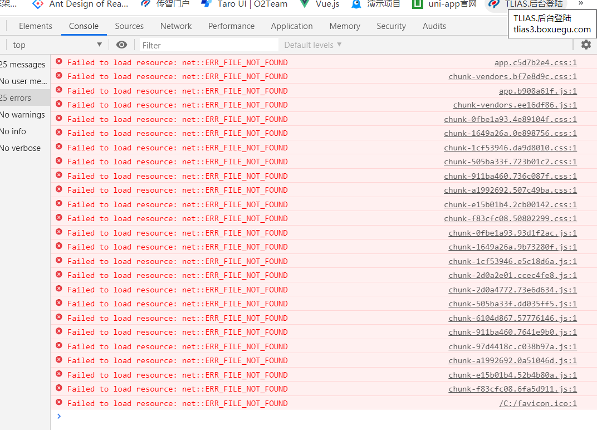
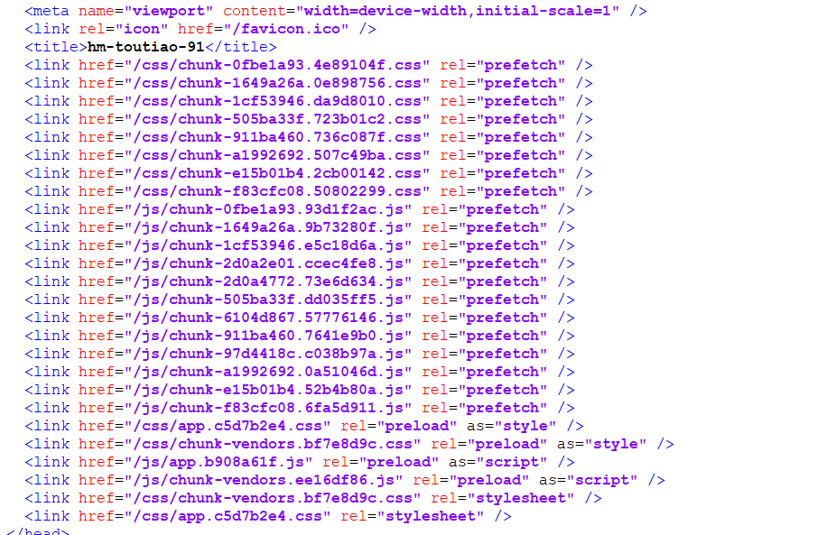
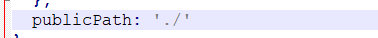
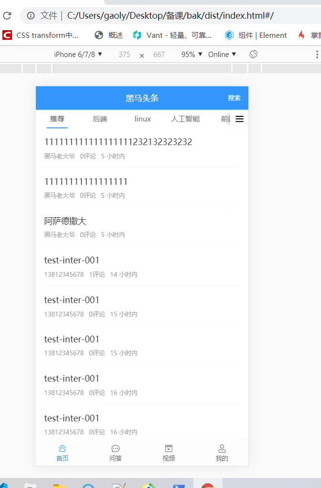

## 组件缓存keep-alive

>到目前为止,我们的主体功能开发了**`70-80%`**, OK, 这些**`功能够了`**! 接下来我们看一下一些体验性的优化
>
>首先**`最重要的`**是 我们进入首页之后,如果点击其他分类,再点击返回,就会造成首页的**`重新加载`**
>
>这是由于我们切换了路由,首页组件销毁,返回之后,首页 又被重新创建,这种糟糕的体验,在移动端产品里面几乎是 **`不可原谅的`**
>
>那么有什么办法能解决这个问题吗?

>接下来,我们引入 **`组件缓存`**的概念
>
>什么是**`组件缓存`**?
>
>组件缓存 就是 **`一旦组件被创建`**, 那么**`就不会被销毁`**, 虽然我们跳转路由 **`看不到`**了组件,但是这个组件并没有销毁,它的dom虽然没了,但是它的虚拟dom还在,只要我们切回路由, 虚拟dom就会立刻转化成dom
>
>那么怎么才能使组件缓存?
>
>vuejs本身提供了一个 名为 **`keep-alive`**的组件,`keep-alive` **`包裹动态组件`**时，会**`缓存`**不活动的组件实例，而不是销毁它们。**`keep-alive`**它自身不会渲染一个 DOM 元素，也不会出现在组件的父组件链中。
>
>也就是,只要 用**`keep-alive`**包裹了组件,那么包裹的组件就不会被销毁,而是被缓存起来
>
>既然 **`keep-alive`**并没有**`杀死`**组件实例,那么组件实例就不会执行对应的 销毁钩子函数 **`beforeDestory`**,那么自然也不会再有**`created`**   **`beforeMount`** **`mounted`**, 但是我们再次进入的时候,怎么才能知道呢?
>
>当keep-alive组件 缓存之后,就不会再执行 钩子函数, 但是当我们第一次进入页面时, 还没有缓存时 ,会执行
>
>钩子函数 => 执行完钩子函数之后  => 缓存  => 跳转到另一个页面  => 再回到这个页面 => 已经缓存
>
>keep-alive 包裹的组件 当再次被**`唤醒`**的时候, 会执行它的 `activated` 和 `deactivated` 这两个函数

使用**`keep-alive`** 包裹的组件,只会执行一遍created/mounted/...

* activated  激活  => 一个组件 从 睡眠 状态 到 被唤醒  =>  触发 激活事件**`activated`**  (钩子函数) 只会在 keep-alive包裹的情况下执行
* deactivated 睡眠 =>  从激活状态 到 睡眠状态 


>OK,那我们包裹谁呢?  我们可以要缓存的是首页,首页是一个二级路由组件,我们可以 直接缓存二级路由容器

>二级路由的容器 在哪个位置?  在 一级路由组件 layout下面

```html
<div class="my-wrapper" :class="{ noTop: !showNavBar }">
      <!-- 如果想要缓存的二级路由组件的话 可以直接缓存二级路由容器
        如果缓存了这个容器 表示 这个容器下的所有的组件都会被缓存
       -->
       <keep-alive>
         <!-- 用keep-alive包裹路由容器 -->
         <router-view></router-view>
       </keep-alive>
    </div>
```

上述代码中,我们将整个二级路由的组件进行了缓存, 我们尝试进入首页之后,进行切换分类,发现页面并没有重新加载,成功了!!!

**`但是`**,我们的首页滚动之后,再次切回去 并没有滚动到原来的位置,**`How to fix it`** ?

这是因为 我们缓存的只是组件实例  => 虚拟dom, 而 我们的dom对象是重新渲染的

我们曾经 封装 article-list组件时, 在最外层 挂载了一个div, 这个div可以用滚动事件来记录滚动的位置

>首先,给article-list组件定义一个属性来记录 当前的组件实例滚动的位置

```js
 scrollTop: 0 // 记录滚动的位置
```

>然后在滚动div时 将滚动的位置记录给 定义的属性

```html
  <div class="scroll-wrapper" @scroll="remember">
```

```js
    // 这是记录滚动事件
    remember (event) {
      // 函数防抖 在一段时间之内 只执行最后一次事件
      clearTimeout(this.timer)
      this.timer = setTimeout(() => {
        //  记录 当前滚动的位置
        this.scrollTop = event.target.scrollTop // 记录滚动的位置
      }, 500)
    }
```

>OK, 接下来 ,我们就需要在该组件实例**`唤醒`**的时候, 判断一下我们实例中的属性是否已经变化了, 如果变化了,我们需要将当前的div滚动回原来的位置

```js
  activated () {
    // 可以在激活函数中 去判断当前是否 scrollTop发生了变化
    if (this.$refs.myScroll && this.scrollTop) {
      //  判断滚动位置是否大于0
      // 将div滚动回原来的位置
      this.$refs.myScroll.scrollTop = this.scrollTop // 将记录的位置 滚动到 对应位置
    }
  }
```

>上面的代码切换 是没有问题的, 但是有一种场景,不满足,什么场景呢? 
>
>我们同时切换多个tab页, 然后滚动页面,  然后切换分类,我们发现,切换之后,只有显示的当前页签才能滚动, 这是因为  所有组件的实例 都同时被**`唤醒`**了,但是只有当前的实例 可以拿到dom,所以我们需要在切换的时候, 
>
>**`通知对应的article-list`**组件实例 来滚动 位置 , 判断每个组件实例中的scrollTop是否为0,如果不为0, 就要去滚动
>
>还是用**`eventBus`**   =>  一个去监听事件 一个去触发事件

首先在 home/index.vue中监听 tabs的切换事件 ,触发一个自定义事件

```html
<van-tabs v-model="activeIndex" swipeable @change="changeTab">
```

```js
 // 切换页签事件
    changeTab () {
      // 切换页签时 我要广播一个消息  让对应的页签中的文章列表  去滚动 滚动条
      // 广播中传出一个参数 传当前谁被激活了 传出当前激活索引的 id
      eventbus.$emit('changeTab', this.channels[this.activeIndex].id)
    },
```

>然后,我们在article-list组件实例中监听该事件, 并且判断切换的id是否等于article-list接收的频道id , 如果相等, 就滚动到对应的滚动条

```js
      eventBus.$on('changeTab', (id) => {
      // 传入的id  就是当前被激活的id
      // 要判断 当前的文章列表  接收的id  是否等于此id 如果相等 表示 该文章列表实例 就是需要去滚动的 实例
      // 一个tab页 下一个实例
      if (id === this.channel_id) {
        // 为什么这里 没有实现效果 因为 tab页切换事件 执行之后 article-list组件渲染 是异步的 没有办法 立刻得出渲染结果
        // 如果相等 表示 我要滚动此滚动条
        // 此时得不到 this.$refs.myScroll
        // 怎么才能保证  执行 该代码时  已经完成了上一次的渲染呢
        // this.$nextTick()  因为 vue是异步渲染, 如果想要等到上一次的结果 渲染完成  可以 在 this.$nextTick中处理
        this.$nextTick(() => {
          // 此时可以保证 之前的上一次的异步渲染已经完成
          if (this.scrollTop && this.$refs.myScroll) {
          // 当滚动距离不为0 并且 滚动元素 存在的情况下 才去滚动
            this.$refs.myScroll.scrollTop = this.scrollTop // 滚动到固定的位置
          }
        })
      }
    })
```

上面代码中的this.$nextTick表示是在下一帧的回调函数中执行该代码

this.$nextTick会在 上一次数据更新 并且完成页面渲染之后执行

## 组件缓存升级

>我们基本实现了 首页切换分类时,可以记录滑动的位置 , 但是我们点击文章详情之后,再返回,还是进行了刷新, 这是什么原因?

因为我们**`keep-alive`**包裹的是二级路由组件, 但是文章详情是一级路由,进入一级路由,整个的**`layout`**组件都不见了,根本不可能缓存 layout下的二级路由组件

>怎么办? 可以再将layout缓存起来! layout是一个一级路由组件,我们也可以用keep-alive来包裹一级路由容器

在app.vue中包裹 一级路由容器

```html
 <keep-alive>
      <router-view  />
 </keep-alive>
```

这样一来,我们进入 文章详情也不会有任何问题了

但是这样一来, 我们几乎将所有的组件实例都缓存了, 这样是不对的,因为我们只想保证layout组件的缓存,并不想把所有的都缓存,因为如果所有组件都缓存了, 就会造成内存变大, 有泄漏的风险

* 一般来说 不会将所有的组件进行缓存 只会挑几个交互需要的组件

>我们可以在**`路由表`** 给 layout组件 一个标识 也就是 **`路由元信息`**`,meta
>
>meta 属性 是route信息里面的一个属性 我们可以在这里存放一些数据 在路由切换的时候使用

```js
 meta: {
      isAlive: true // 是否缓存组件实例
 },
```

>通过这个标记 来决定 是否 采用 keep-alive来包裹 我们的一级路由容器

```html
  <div id="app">
    <keep-alive>
      <!-- 里面是当需要缓存时 -->
      <router-view  v-if="$route.meta.isAlive" />
    </keep-alive>
     <!-- 外面是不需要缓存时 -->
    <router-view  v-if="!$route.meta.isAlive" />
  </div>
```

OK!  终于 我们完成了 这个缓存的功能.

有条件的进行 了**`一级路由缓存`**

## 打包

>我们知道,开发完毕之后,就要进行打包测试,

* 打包是什么?

>webpack 是一个打包工具 ,可以把我们写的代码 (vue代码 ,less代码 ,es6代码,图片.资源, jsx代码,小程序代码)
>
>打包  浏览器可识别的  html/js/css   => 上线
>
>源代码  => 工具(webpack) => 浏览器可识别代码(html/js/css)

打包命令我们都会

>production  生产环境  => 真实的正式环境 => 要求代码必须整洁,压缩混淆没有垃圾 (console,debugger)  => 环境变量的值就是 production
>
>development 开发环境 => 开发在开发环境  npm run serve  => 环境变量的值就是 development  

```bash
$ npm run build 
```

但是之前写了很多的**`console`**, 用来调试的时候用, 打包的时候会报错, 一个个得删除又太麻烦了!

>我们可以借用一个webpack插件来解决这个问题

> 首先先安装这个webpack插件

```bash
$ npm install terser-webpack-plugin --save-dev #是开发时依赖哦
$ yarn add terser-webpack-plugin --dev
```

>然后需要配置webpack的配置文件,还记得吗? 我们的vue-cli的配置文件在 vue.config.js里面

之前学webpack的时候 , 之前有一个webpack的配置文件,  

**`webpack.config.js`**   => 专门配置项目中的webpack

vue-cli 脚手架 => 其实也是用的 webpack, 但是vue-cli对 webpack进行了重写以及一些改动

>其实虽然本质上用的还是webpack,但是我们需要根据vue-cli提供的配置方式去配置
>
>也就是在根目录下 创建一个 vue.config.js  => 就会被当做 对于vue-cli项目中的配置
>
>[文档地址]([https://cli.vuejs.org/zh/guide/webpack.html#%E7%AE%80%E5%8D%95%E7%9A%84%E9%85%8D%E7%BD%AE%E6%96%B9%E5%BC%8F](https://cli.vuejs.org/zh/guide/webpack.html#简单的配置方式))

```js
module.export = {
  configureWebpack: (config)=>{
    if(process.env.NODE_ENV === 'production'){
      config.optimization.minimizer[0].options.terserOptions.compress.drop_console = true
    }
  }
}
```

>这里再教大家一个命令

>导出当前vue项目的 webpack配置

```bash
$ vue inspect --mode=production > demo.js #导出当前生产模式下的webpack配置文件到demo.js
```

>这里有个地方需要特别说明下

> 在给.eslintrc.js的rules配置了no-console的情况下，修改代码后的**`首次打包`**eslint-loader总会在终端上报 `error: Unexpected console statement (no-console)`，虽然打包过程中报错，但是最终的输出代码是没有console.log的； 所以 **`首次打包`** 是有报错的, 但是 首次之后, 就一切OK了

但是打包完毕之后,我们访问index.html,页面是空白的!

**`why`**?



通过上面的错误我们发现,是index.html并没有引到打包的js文件, 因为我们直接通过文件系统访问,但是 index.html中的引用路径是这样的



只有在http web服务中才可以通过 **`/`**来访问,这时我们并没有启动http服务, 所以我们可以把**`/`**换成**`./`**

**`./`**可以被文件系统访问识别

怎么改?

我们可以在vue.config.js中加上如下配置



然后再次进行打包

我们发现 点击index.html ,已经可以正常访问了



截止到现在,我们的移动端功能开发就暂且告一段落, 我们即将进入 Vuejs进阶部分 . 大家尽请期待.